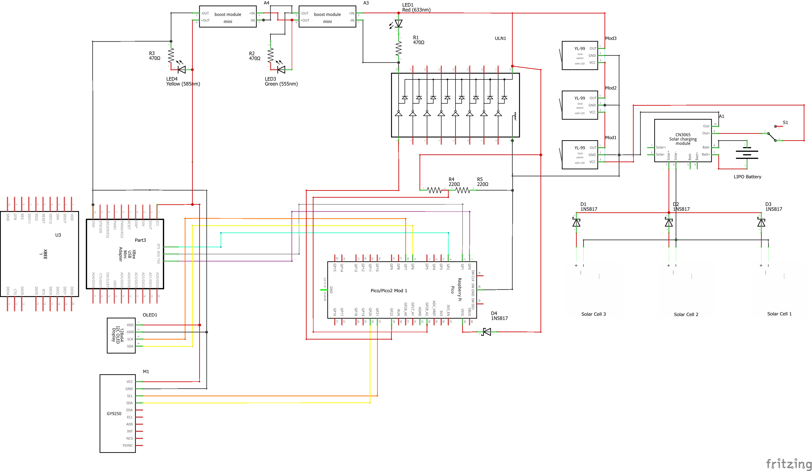
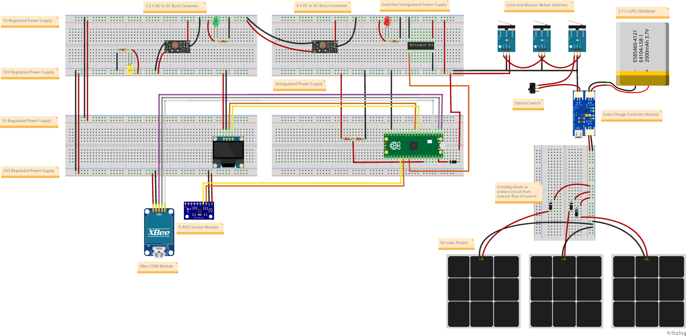

# VyomSat Step 1: EPS + COM + 9-Axis IMU Integration

**VyomSat - Essence of Space. Built by You.**

This step builds upon Step 0 (EPS + COM) by adding 9-axis attitude sensing capabilities using the MPU9250 IMU sensor. The system now provides complete orientation and motion data for CubeSat applications.

## Overview

Step 1 extends the foundational Electrical Power System (EPS) monitoring and communication capabilities with a 9-axis Inertial Measurement Unit (IMU). The system continuously measures battery voltage, communicates via UART, and provides comprehensive attitude data through accelerometer, gyroscope, and magnetometer sensors.

**New in Step 1:**
- 🧭 **MPU9250 9-Axis IMU** - Complete attitude sensing with accelerometer, gyroscope, and magnetometer
- 📊 **Attitude Data Display** - Pitch, roll, and heading calculations with multi-screen OLED visualization
- 🎯 **Command 'a'** - Real-time attitude data capture and telemetry transmission
- 📈 **Sensor Fusion** - Complementary filter for accurate tilt angle estimation

**Retained from Step 0:**
- 📊 Battery Voltage Monitoring
- 📺 OLED Display (128x64 SSD1306)
- 📡 UART Communication (XBee)
- 🎛️ Command Interface
- ⚡ Hardware Reset Management

## Features

### 9-Axis IMU Capabilities

The MPU9250 provides complete 9-axis motion sensing:

- **3-Axis Accelerometer**: Linear acceleration measurement (m/s²)
  - Measures gravity and motion forces
  - Used for tilt angle calculation
  - Range: ±2g to ±16g (configurable)

- **3-Axis Gyroscope**: Angular velocity measurement (°/s)
  - Measures rotation rate
  - Used for motion detection and rate measurements
  - Range: ±250°/s to ±2000°/s (configurable)

- **3-Axis Magnetometer**: Magnetic field measurement (μT)
  - Earth's magnetic field sensing (compass)
  - Heading calculation (0-360°)
  - Range: ±4800 μT

- **Temperature Sensor**: On-chip temperature monitoring
  - Thermal compensation for sensors
  - Range: -40°C to +85°C

### Calculated Attitude Data

- **Pitch**: Forward/backward tilt angle (-90° to +90°)
- **Roll**: Left/right tilt angle (-180° to +180°)
- **Heading**: Compass direction (0° = North, 90° = East, 180° = South, 270° = West)
- **Sensor Fusion**: Complementary filter combining accelerometer and gyroscope data

## Hardware Requirements

### Components

- Raspberry Pi Pico 2 or Pico W
- SSD1306 OLED Display (128x64 pixels, I2C)
- MPU9250 9-Axis IMU Sensor Module (I2C)
- XBee module (or compatible UART device)
- Battery voltage divider circuit
- 4.7kΩ pull-up resistors for I2C lines (2x for IMU)

### Wiring Connections

| Component | Pico Pin | Description |
|-----------|----------|-------------|
| **OLED Display** | | |
| SCL | GP7 | I2C Serial Clock |
| SDA | GP6 | I2C Serial Data |
| VCC | 3.3V | Power |
| GND | GND | Ground |
| **MPU9250 9-Axis IMU** | | |
| SCL | GP21 | I2C Serial Clock |
| SDA | GP20 | I2C Serial Data |
| VCC | 3.3V | Power |
| GND | GND | Ground |
| **XBee Module** | | |
| TX (Pico → XBee) | GP0 | UART0 Transmit |
| RX (XBee → Pico) | GP1 | UART0 Receive |
| RST | GP2 | Hardware Reset (optional) |
| GND | GND | Common Ground |
| **Battery Sensing** | | |
| ADC Input | GP28 | Battery voltage via divider |

> **Important Notes**: 
> - The MPU9250 requires 4.7kΩ pull-up resistors on both SCL and SDA lines for reliable I2C communication
> - The OLED and MPU9250 use separate I2C buses (different GPIO pins) to prevent conflicts
> - Battery voltage must be reduced to 0-3.3V range using a voltage divider circuit

### Circuit Diagrams

Visual references for hardware setup are provided using Fritzing diagrams:

#### Schematic Diagram


The schematic shows the complete electrical connections including:
- Solar panel array with charge controller (CN3065)
- Multiple power rails (3.3V, 5V) with boost/buck converters
- Raspberry Pi Pico/Pico2 connections
- OLED display I2C interface (GP6/GP7)
- MPU9250 9-axis IMU I2C interface (GP20/GP21)
- XBee communication module
- Battery voltage sensing circuit
- LED status indicators
- Limit switches for mission control
- Power management components

#### Breadboard Layout


The breadboard layout provides a practical wiring guide showing:
- Physical component placement
- Wire routing and connections
- Power distribution
- Module interconnections
- MPU9250 sensor positioning

#### Bill of Materials (BOM)
A complete parts list with quantities and specifications is available: **[9axis_bom.html](9axis_bom.html)**

The BOM includes all components from Step 0 plus:
- MPU9250 9-axis IMU sensor module (GY-9250)
- Additional pull-up resistors (4.7kΩ for I2C)
- All resistors, capacitors, ICs, and modules required

> **Fritzing Software**: These diagrams were created using [Fritzing](https://fritzing.org/), an open-source electronics design tool. Download from [fritzing.org/download](https://fritzing.org/download/) to view or modify the designs.

## Architecture

The system builds on Step 0's modular architecture with new IMU capabilities:

### New Module: `vyomsat_9axis_manager.py`
Handles MPU9250 9-axis IMU sensor operations.

**Key Functions:**
- `initialize_9axis_sensor(scl_pin, sda_pin, i2c_frequency)`: Initializes the MPU9250 with I2C configuration
- `read_and_display_9axis_data(uart_handler, oled_manager)`: Reads comprehensive sensor data and displays on USB, UART, and OLED
- `is_9axis_available()`: Checks if sensor is initialized and available
- `get_9axis_status()`: Returns sensor status information

**How it works:**
- Initializes separate I2C bus for MPU9250 (GPIO 20/21)
- Configures both MPU6500 (accelerometer + gyroscope) and AK8963 (magnetometer)
- Reads raw sensor data from all three sensors
- Calculates tilt angles using accelerometer data
- Applies complementary filter for stable attitude estimation
- Calculates magnetic heading from magnetometer data
- Provides formatted output for display and telemetry

**Multi-Screen OLED Display:**
When command 'a' is received, the system cycles through 4 screens (2 seconds each):
1. **Accelerometer Screen**: X, Y, Z axes and total magnitude
2. **Gyroscope Screen**: X, Y, Z axes and total magnitude
3. **Magnetometer Screen**: X, Y, Z axes and total magnitude
4. **Attitude Screen**: Pitch, roll, heading, and temperature

### Updated: `vyomsat.py`
Main integration module extended with 9-axis IMU support.

**Changes from Step 0:**
- Added 9-axis IMU initialization in `main()` function
- Updated command 'a' handler to call `read_and_display_9axis_data()`
- Graceful degradation if IMU not available
- Documentation updated for MPU9250 9-axis sensor

**Operational Flow:**
```
┌─────────────────────────────────────────────┐
│ 1. Initialize Hardware                      │
│    - LED & GPIO pins                        │
│    - XBee hardware reset                    │
│    - Battery ADC sensor                     │
│    - 9-Axis IMU sensor (NEW)                │
│    - OLED display                           │
│    - UART communication                     │
└─────────────────────────────────────────────┘
                    ↓
┌─────────────────────────────────────────────┐
│ 2. Main Loop (every 4 seconds)             │
│    ┌─────────────────────────────────────┐ │
│    │ a. Read battery voltage             │ │
│    │ b. Update OLED with telemetry       │ │
│    │ c. Send telemetry via UART          │ │
│    │ d. Process incoming UART commands   │ │
│    │ e. Print status to USB console      │ │
│    └─────────────────────────────────────┘ │
└─────────────────────────────────────────────┘
```

### Retained Modules from Step 0

**`vyomsat_battery_manager.py`**: Battery voltage sensing via ADC  
**`vyomsat_oled_manager.py`**: SSD1306 OLED display management  
**`vyomsat_xbee_manager.py`**: XBee hardware reset handling

## Telemetry Output

### USB Serial Console - Normal Operation
```
[12345ms] Telemetry Sent | Voltage: 6.90V | Bytes: 65 | Counter: 42
```

### USB Serial Console - 9-Axis Data (Command 'a')
```
======================================================================
MPU9250 9-AXIS IMU ATTITUDE DATA
======================================================================
Timestamp: 12345 ms
Temperature: 25.34 °C

ACCELEROMETER (m/s²):
  X:   0.123  Y:   0.456  Z:   9.789
  Total Magnitude: 9.812 m/s²

GYROSCOPE (°/s):
  X:   0.12  Y:  -0.34  Z:   0.56
  Total Magnitude: 0.67 °/s

MAGNETOMETER (μT):
  X:  23.45  Y: -12.34  Z:  45.67
  Total Magnitude: 52.34 μT

ATTITUDE (FILTERED):
  Pitch:    2.67°
  Roll:    -1.23°
  Heading: 125.4° (Magnetic North)
======================================================================
```

### UART (XBee) - Normal Operation
```
[12345ms] VyomSat EPS | Voltage: 6.90V | Msg: #42
```

### UART (XBee) - 9-Axis Data (Command 'a')
```
======================================================================
MPU9250 9-AXIS IMU COMPREHENSIVE DATA
======================================================================
Timestamp: 12345 ms
Temperature: 25.34 C

ACCELEROMETER (m/s^2):
  X:   0.123  Y:   0.456  Z:   9.789
  Total Magnitude: 9.812 m/s^2

GYROSCOPE (deg/s):
  X:   0.12  Y:  -0.34  Z:   0.56
  Total Magnitude: 0.67 deg/s

MAGNETOMETER (uT):
  X:  23.45  Y: -12.34  Z:  45.67
  Total Magnitude: 52.34 uT

ATTITUDE (FILTERED):
  Pitch:    2.67 deg
  Roll:    -1.23 deg
  Heading: 125.4 deg (Magnetic North)
======================================================================
```

### OLED Display - Normal Operation
```
VyomSat EPS
Time: 14:23:45
Batt: 6.90V
Msg: 42
```

### OLED Display - 9-Axis Data (Command 'a' - 4 Screens)

**Screen 1: Accelerometer (2 seconds)**
```
ACCELEROMETER  14:23:45
X:  0.12m/s2
Y:  0.46m/s2
Z:  9.79m/s2
Mag:  9.81m/s2
```

**Screen 2: Gyroscope (2 seconds)**
```
GYROSCOPE      14:23:45
X:    0.1deg/s
Y:   -0.3deg/s
Z:    0.6deg/s
Mag:   0.7deg/s
```

**Screen 3: Magnetometer (2 seconds)**
```
MAGNETOMETER   14:23:45
X:   23.5uT
Y:  -12.3uT
Z:   45.7uT
Mag:  52.3uT
```

**Screen 4: Attitude & Temperature (2 seconds)**
```
ATTITUDE       14:23:45
Pitch:   2.7deg
Roll:   -1.2deg
Hdg:   125.4deg
Temp:  25.3C
```

## Supported UART Commands

Send single character commands to control the system:

| Command | Function | Response | Status |
|---------|----------|----------|--------|
| `a` | **9-axis IMU attitude data** | Comprehensive sensor data | **NEW** ✨ |
| `v` | Request voltage reading | Detailed voltage data | Active |
| `b` | System reset | ACK (placeholder) | Reserved |
| `c` | Camera capture | ACK (placeholder) | Reserved |
| `s` | SD card logging | ACK (placeholder) | Reserved |
| `g` | GPS data capture | ACK (placeholder) | Reserved |

### Command 'a' - 9-Axis Attitude Data (NEW)

**Behavior:**
1. Reads comprehensive data from MPU9250
2. Displays detailed output on USB serial console
3. Sends formatted data via UART
4. Cycles through 4 OLED screens (8 seconds total)
5. Returns to normal telemetry display

**Example:**
```
Send: a

Receive (UART): ACK: MPU9250 capture initiated
                [comprehensive 9-axis data follows]

Display (OLED): [4 screens cycle automatically]
```

### Command 'v' - Voltage Reading

**Example:**
```
Send: v

Receive: ACK: Battery voltage reading initiated
         [timestamp] BATTERY VOLTAGE | Batt: 6.900V | ADC: 3.450V | Raw: 32768
```

## Usage

### 1. Setup Hardware
Connect all components according to the wiring table above. Pay special attention to:
- 4.7kΩ pull-up resistors on MPU9250 I2C lines (SCL and SDA)
- Separate I2C buses for OLED (GP6/7) and IMU (GP20/21)
- Common ground connections for all modules

### 2. Get Required Libraries

The manager modules depend on sensor and breakout board libraries from the [OjasJha/micropython-lib](https://github.com/OjasJha/micropython-lib.git) repository.

Clone or download the repository:
```bash
git clone https://github.com/OjasJha/micropython-lib.git
```

**Required libraries for Step 1:**

*From Step 0:*
- `com/uart/uart_handler.py` - UART communication handler
- `io/oled-ssd1306/ssd1306_handler.py` - SSD1306 OLED display driver

*NEW for Step 1:*
- `sensors/mpu9250/mpu9250_handler.py` - MPU9250 9-axis IMU handler
- `sensors/mpu9250/mpu6500_handler.py` - MPU6500 6-axis IMU handler (accelerometer + gyroscope)
- `sensors/mpu9250/ak8963_handler.py` - AK8963 3-axis magnetometer handler
- `sensors/mpu9250/mpu9250.py` - Low-level MPU9250 driver
- `sensors/mpu9250/mpu6500.py` - Low-level MPU6500 driver
- `sensors/mpu9250/ak8963.py` - Low-level AK8963 driver

> **Important**: Copy these library files directly to the same folder as the VyomSat modules (flat structure). Do NOT maintain the directory structure from the repository.

### 3. Upload Code

Copy all Python files to your Raspberry Pi Pico in the **same folder**:

**VyomSat Step 1 Modules:**
- `vyomsat.py`
- `vyomsat_battery_manager.py`
- `vyomsat_oled_manager.py`
- `vyomsat_xbee_manager.py`
- `vyomsat_9axis_manager.py` ← **NEW**

**Libraries from micropython-lib repository:**
- `uart_handler.py` (from `com/uart/`)
- `ssd1306_handler.py` (from `io/oled-ssd1306/`)
- `mpu9250_handler.py` (from `sensors/mpu9250/`) ← **NEW**
- `mpu6500_handler.py` (from `sensors/mpu9250/`) ← **NEW**
- `ak8963_handler.py` (from `sensors/mpu9250/`) ← **NEW**
- `mpu9250.py` (from `sensors/mpu9250/`) ← **NEW**
- `mpu6500.py` (from `sensors/mpu9250/`) ← **NEW**
- `ak8963.py` (from `sensors/mpu9250/`) ← **NEW**

All files should be in the root directory of your Pico, or in the same folder.

### 4. Run
```python
# On Pico - execute main script
python vyomsat.py
```

Or set it as `main.py` to run automatically on boot.

### 5. Monitor & Test

**Startup:**
1. Watch USB console for initialization messages
2. Verify 9-axis IMU initialization: `[OK]9-axis IMU sensor initialized successfully!`
3. Check OLED display shows normal telemetry

**Test Command 'a':**
1. Send 'a' via UART (XBee)
2. Observe USB console for detailed 9-axis data
3. Watch OLED cycle through 4 screens (8 seconds)
4. Receive comprehensive data via UART
5. Move/rotate sensor and observe changing values

**Normal Operation:**
- **USB Console**: Monitor debug output (115200 baud)
- **OLED**: View real-time telemetry
- **XBee**: Receive telemetry stream and send commands

## Configuration

Key constants in `vyomsat.py`:

```python
# OLED Display
OLED_SCL_PIN = 7              # I2C clock pin
OLED_SDA_PIN = 6              # I2C data pin

# Battery Monitoring
BATTERY_ADC_CHANNEL = 2                    # ADC2 (GP28)
BATTERY_VOLTAGE_DIVIDER_FACTOR = 0.5       # 2:1 voltage divider

# UART Communication
UART_BAUDRATE = 9600          # Standard XBee baudrate
UART_TX_PIN = 0               # GP0
UART_RX_PIN = 1               # GP1

# XBee Reset
XBEE_RESET_PIN = 2            # GP2
XBEE_INIT_DELAY_SECONDS = 5   # Boot delay

# 9-Axis IMU Sensor (NEW)
NINE_AXIS_SCL_PIN = 21        # GPIO 21 for I2C Serial Clock
NINE_AXIS_SDA_PIN = 20        # GPIO 20 for I2C Serial Data
NINE_AXIS_I2C_FREQ = 400000   # I2C bus frequency (400kHz)

# Telemetry Rate
MAIN_LOOP_DELAY_SECONDS = 4   # Update interval
```

## Understanding the 9-Axis Data

### When Sensor is Stationary (Level Surface)

| Sensor | Expected Reading | Meaning |
|--------|------------------|---------|
| Accelerometer | ~9.81 m/s² (Z-axis) | Measures Earth's gravity |
| | ~0 m/s² (X, Y axes) | No horizontal acceleration |
| Gyroscope | ~0 °/s (all axes) | No rotation (minor drift is normal) |
| Magnetometer | Varies by location | Earth's magnetic field (25-65 μT) |
| Pitch | ~0° | Level (front-back) |
| Roll | ~0° | Level (left-right) |
| Heading | Depends on orientation | Compass direction |

### When Sensor is Moving/Rotating

| Motion | Sensor Response |
|--------|----------------|
| Tilting forward | Accelerometer: X increases, Pitch increases |
| Tilting left | Accelerometer: Y changes, Roll changes |
| Rotating horizontally | Gyroscope: Z-axis shows rotation rate, Heading changes |
| Linear motion | Accelerometer shows combined gravity + motion |
| Fast rotation | Gyroscope values increase |

### Coordinate System

```
      Z (Up)
      |
      |
      +---- X (Forward)
     /
    /
   Y (Right)
```

## Troubleshooting

| Issue | Solution |
|-------|----------|
| **9-axis IMU not initializing** | Check wiring (SCL→GP21, SDA→GP20, VCC→3.3V, GND→GND) |
| | Verify 4.7kΩ pull-up resistors on both SCL and SDA |
| | Check I2C address: MPU6500 (0x68), AK8963 (0x0C) |
| | Ensure bypass mode enabled for magnetometer |
| **Incorrect accelerometer readings** | Should read ~9.81 m/s² total when stationary |
| | Calibrate if consistently offset |
| **Gyroscope drifting** | Normal to have small drift (~0.5 °/s) |
| | Excessive drift may indicate temperature effects |
| **Magnetometer readings unstable** | Keep away from magnetic interference (motors, speakers) |
| | Hard iron calibration may be needed |
| | Ensure sensor is away from metal objects |
| **Heading incorrect** | Magnetometer needs calibration for local environment |
| | Sensor orientation matters for heading calculation |
| | Declination angle correction may be needed |
| **OLED screens not cycling** | Verify OLED manager is passed to function |
| | Check USB console for error messages |
| **No OLED display** | Check I2C wiring (SCL→GP7, SDA→GP6) and power |
| **OLED garbled text** | Try I2C address 0x3D instead of 0x3C |
| **No UART communication** | Verify TX/RX connections and common ground |
| **Incorrect voltage** | Check voltage divider circuit and calibration |

## Technical Details

### MPU9250 Sensor Architecture

The MPU9250 contains two sensors in one package:

**MPU6500 (6-axis IMU):**
- I2C Address: 0x68
- 3-axis accelerometer: ±2g, ±4g, ±8g, ±16g
- 3-axis gyroscope: ±250, ±500, ±1000, ±2000 °/s
- Temperature sensor: -40°C to +85°C
- 16-bit ADCs for high precision

**AK8963 (3-axis Magnetometer):**
- I2C Address: 0x0C (accessed through MPU6500 bypass)
- Measurement range: ±4800 μT
- 14-bit or 16-bit output
- Compass accuracy: better than 0.6° RMS

### Sensor Fusion Algorithm

The system uses a complementary filter to combine accelerometer and gyroscope data:

```
Filtered_Angle = α × (Gyro_Angle) + (1-α) × (Accel_Angle)
```

- **α (alpha)**: Typically 0.96-0.98
- **Gyro_Angle**: Short-term accuracy, drifts over time
- **Accel_Angle**: Long-term accuracy, noisy short-term
- **Result**: Stable, responsive angle estimation

### ADC Resolution
- **Hardware**: 12-bit ADC (0-4095)
- **MicroPython**: 16-bit reading (0-65535)
- **Reference**: 3.3V
- **Conversion Factor**: 3.3V / 65535 = 0.0000503540 V/count

### I2C Communication

| Bus | Pins | Frequency | Address | Purpose |
|-----|------|-----------|---------|---------|
| I2C0 | GP6/GP7 | 400 kHz | 0x3C | OLED Display |
| I2C1 | GP20/GP21 | 400 kHz | 0x68, 0x0C | MPU9250 IMU |

### UART Communication
- **Baud Rate**: 9600 bps
- **Data Bits**: 8
- **Parity**: None
- **Stop Bits**: 1
- **Flow Control**: None

## Changes from Step 0

### Hardware Additions
- ✅ MPU9250 9-axis IMU sensor module
- ✅ 4.7kΩ pull-up resistors for I2C (SCL and SDA)
- ✅ Additional I2C bus (GP20/GP21)

### Software Additions
- ✅ `vyomsat_9axis_manager.py` - New module for IMU management
- ✅ MPU9250 handler libraries (4 files)
- ✅ Command 'a' implementation for attitude data
- ✅ Multi-screen OLED display cycling
- ✅ Sensor fusion for tilt angle calculation
- ✅ Heading calculation from magnetometer

### Functional Improvements
- ✅ Complete 9-axis motion sensing capability
- ✅ Real-time attitude data (pitch, roll, heading)
- ✅ Comprehensive telemetry output (USB, UART, OLED)
- ✅ Graceful degradation if IMU not available
- ✅ Enhanced error handling and status reporting

## Next Steps

This Step 1 module provides advanced attitude sensing capabilities. Future steps will add:
- Step 2: GPS module integration for position data
- Step 3: SD card data logging for long-term storage
- Step 4: Camera module for image capture
- Step 5: Complete mission payload integration

## Testing Procedure

### 1. Hardware Verification
- [ ] All connections secure and correct
- [ ] 4.7kΩ pull-up resistors installed on IMU I2C lines
- [ ] Power supply stable (3.3V to all modules)
- [ ] Common ground connected to all modules

### 2. Software Verification
- [ ] All required libraries uploaded to Pico
- [ ] Main script runs without errors
- [ ] USB console shows successful initialization

### 3. Sensor Testing
- [ ] Battery voltage displays correctly
- [ ] OLED shows normal telemetry
- [ ] UART telemetry transmits every 4 seconds
- [ ] IMU initialization message: `[OK]9-axis IMU sensor initialized successfully!`

### 4. Command 'a' Testing
- [ ] Send 'a' via UART
- [ ] USB console shows comprehensive 9-axis data
- [ ] UART receives complete attitude data
- [ ] OLED cycles through 4 screens (8 seconds total)
- [ ] System returns to normal telemetry

### 5. Motion Testing
- [ ] Place sensor on level surface: pitch and roll near 0°
- [ ] Tilt forward: pitch increases
- [ ] Tilt left: roll changes
- [ ] Rotate horizontally: heading changes
- [ ] Move quickly: gyroscope shows rotation rates
- [ ] Total acceleration near 9.81 m/s² when stationary

## License

MIT License - Copyright (c) 2025 Ojas Jha

See individual Python files for full license text.

## Author

**Ojas Jha**  
VyomSat CubeSat Education Kit  
Date: October 25, 2025

## Acknowledgments

- Step 0 (EPS + COM) provides the foundation for this implementation
- MPU9250 sensor drivers based on community MicroPython libraries
- Fritzing diagrams created with Fritzing open-source software

