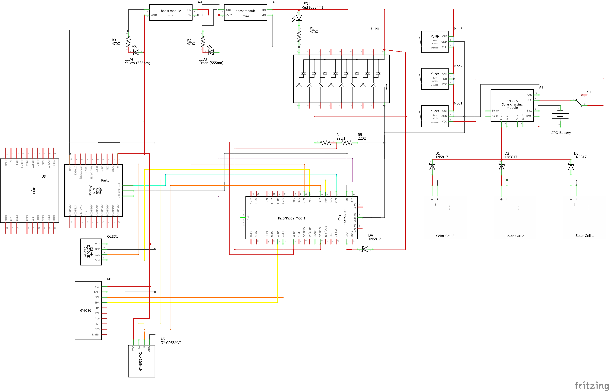
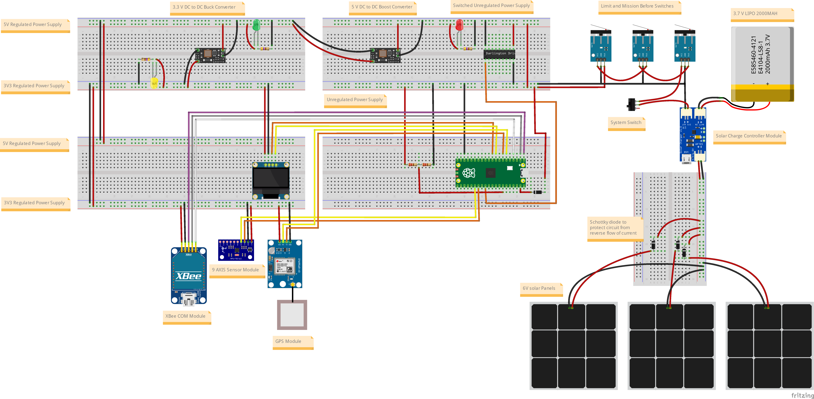

# VyomSat Step 2: EPS + COM + 9-Axis IMU + GPS Integration

**VyomSat - Essence of Space. Built by You.**

This step builds upon Step 1 (EPS + COM + 9-Axis IMU) by adding GPS positioning capabilities using the NEO-6M GPS module. The system now provides complete location tracking with latitude, longitude, altitude, and satellite information for CubeSat applications.

## Overview

Step 2 extends the 9-axis attitude sensing system with GPS positioning capabilities. The system continuously measures battery voltage, communicates via UART, provides comprehensive attitude data through the MPU9250 IMU, and now tracks precise geographic location using GPS satellites.

**New in Step 2:**
- 🛰️ **NEO-6M GPS Module** - Complete position tracking with satellite navigation
- 📍 **Location Data** - Latitude, longitude, altitude, and satellite count
- 🕐 **GPS Time & Date** - UTC time with local timezone conversion
- 🎯 **Command 'g'** - Real-time GPS data capture and telemetry transmission
- 🌐 **Speed & Heading** - Course over ground and compass direction from GPS
- 📊 **Enhanced Telemetry** - GPS coordinates integrated into regular data stream

**Retained from Step 1:**
- 🧭 MPU9250 9-Axis IMU (accelerometer, gyroscope, magnetometer)
- 📊 Attitude Data (pitch, roll, heading)
- 🎯 Command 'a' for 9-axis data capture
- 📈 Sensor Fusion for tilt angle estimation

**Retained from Step 0:**
- 📊 Battery Voltage Monitoring
- 📺 OLED Display (128x64 SSD1306)
- 📡 UART Communication (XBee)
- 🎛️ Command Interface
- ⚡ Hardware Reset Management

## Features

### GPS Positioning Capabilities

The NEO-6M GPS module provides complete satellite navigation:

- **Position Data**: Geographic coordinates
  - Latitude: Degrees, minutes, seconds + decimal degrees
  - Longitude: Degrees, minutes, seconds + decimal degrees
  - Altitude: Meters above mean sea level
  - Geoid separation: Height of geoid above WGS84 ellipsoid

- **Time & Date**: UTC time from GPS satellites
  - GPS Time: Hours, minutes, seconds (UTC)
  - Local Time: Configurable timezone offset (default: UTC+4 for Dubai)
  - Date: Day, month, year

- **Motion Data**: Speed and direction
  - Speed: km/h, mph, knots
  - Course over ground: 0-360 degrees
  - Compass direction: N, NE, E, SE, S, SW, W, NW

- **Satellite Information**: Fix quality metrics
  - Satellites in view: Total visible satellites
  - Satellites in use: Satellites used for position fix
  - Satellite IDs: List of PRN numbers in use

- **Fix Quality Metrics**: Accuracy indicators
  - HDOP: Horizontal Dilution of Precision
  - VDOP: Vertical Dilution of Precision
  - PDOP: Position Dilution of Precision
  - Fix quality: 0=Invalid, 1=GPS fix, 2=DGPS fix
  - Fix type: 1=No fix, 2=2D fix, 3=3D fix

### GPS Integration Features

- **Continuous GPS Reading**: Non-blocking UART read from NEO-6M
- **NMEA Sentence Parsing**: GGA, RMC, GSA, GSV sentence support
- **Basic GPS Data**: Integrated into regular telemetry (lat/lon)
- **Comprehensive GPS Display**: Detailed diagnostics via command 'g'
- **Multi-Screen OLED**: 3 GPS screens showing position, time/motion, quality
- **Graceful Degradation**: System works even if GPS not available or no fix

## Hardware Requirements

### Components

- Raspberry Pi Pico 2 or Pico W
- SSD1306 OLED Display (128x64 pixels, I2C)
- MPU9250 9-Axis IMU Sensor Module (I2C)
- **NEO-6M GPS Module (UART)** ← **NEW**
- XBee module (or compatible UART device)
- Battery voltage divider circuit
- 4.7kΩ pull-up resistors for I2C lines (2x for IMU)

### Wiring Connections

| Component | Pico Pin | Description |
|-----------|----------|-------------|
| **OLED Display** | | |
| SCL | GP7 | I2C Serial Clock |
| SDA | GP6 | I2C Serial Data |
| VCC | 3.3V | Power |
| GND | GND | Ground |
| **MPU9250 9-Axis IMU** | | |
| SCL | GP21 | I2C Serial Clock |
| SDA | GP20 | I2C Serial Data |
| VCC | 3.3V | Power |
| GND | GND | Ground |
| **NEO-6M GPS Module** | | **NEW** |
| TX (GPS → Pico) | GP5 | UART1 Receive |
| RX (Pico → GPS) | GP4 | UART1 Transmit |
| VCC | 3.3V | Power |
| GND | GND | Ground |
| **XBee Module** | | |
| TX (Pico → XBee) | GP0 | UART0 Transmit |
| RX (XBee → Pico) | GP1 | UART0 Receive |
| RST | GP2 | Hardware Reset (optional) |
| GND | GND | Common Ground |
| **Battery Sensing** | | |
| ADC Input | GP28 | Battery voltage via divider |

> **Important Notes**: 
> - The NEO-6M GPS module requires a clear view of the sky for satellite acquisition
> - GPS cold start can take 30+ seconds, warm start typically 1-5 seconds
> - UART1 (GP4/GP5) is used for GPS communication at 9600 baud
> - UART0 (GP0/GP1) remains for XBee communication
> - The MPU9250 requires 4.7kΩ pull-up resistors on both SCL and SDA lines
> - Battery voltage must be reduced to 0-3.3V range using a voltage divider circuit

### Circuit Diagrams

Visual references for hardware setup are provided using Fritzing diagrams:

#### Schematic Diagram


The schematic shows the complete electrical connections including:
- Solar panel array with charge controller (CN3065)
- Multiple power rails (3.3V, 5V) with boost/buck converters
- Raspberry Pi Pico/Pico2 connections
- OLED display I2C interface (GP6/GP7)
- MPU9250 9-axis IMU I2C interface (GP20/GP21)
- NEO-6M GPS module UART1 interface (GP4/GP5)
- XBee communication module on UART0 (GP0/GP1)
- Battery voltage sensing circuit
- LED status indicators
- Limit switches for mission control
- Power management components

#### Breadboard Layout


The breadboard layout provides a practical wiring guide showing:
- Physical component placement
- Wire routing and connections
- Power distribution
- Module interconnections
- GPS module positioning with antenna

#### Bill of Materials (BOM)
A complete parts list with quantities and specifications is available: **[gps_bom.html](gps_bom.html)**

The BOM includes all components from Steps 0 and 1 plus:
- NEO-6M GPS sensor module (GY-GPS6MV2)
- GPS ceramic antenna (usually integrated with module)
- All resistors, capacitors, ICs, and modules required

> **Fritzing Software**: These diagrams were created using [Fritzing](https://fritzing.org/), an open-source electronics design tool. Download from [fritzing.org/download](https://fritzing.org/download/) to view or modify the designs.

## Architecture

The system builds on Step 1's modular architecture with new GPS capabilities:

### New Module: `vyomsat_gps_manager.py`
Handles NEO-6M GPS sensor operations and NMEA sentence parsing.

**Key Functions:**
- `initialize_gps_sensor(uart_id, tx_pin, rx_pin, baudrate, timezone_offset_hours)`: Initializes GPS with UART1 configuration
- `read_gps_data()`: Non-blocking GPS data read from UART (call in main loop)
- `get_basic_gps_data()`: Returns lat/lon for regular telemetry display
- `read_and_display_full_gps_data(uart_handler, oled_manager)`: Comprehensive GPS diagnostics
- `is_gps_available()`: Checks if GPS has valid fix
- `update_oled_with_gps_and_hk(oled_manager, battery_voltage, message_counter)`: Updates OLED with GPS + housekeeping data

**How it works:**
- Initializes UART1 for GPS communication (9600 baud on GPIO 4/5)
- Creates NEO6MV2Handler instance for NMEA sentence parsing
- Reads GPS data non-blockingly in main loop
- Parses NMEA sentences: GGA (position), RMC (time/motion), GSA (satellites), GSV (satellite view)
- Provides basic GPS data (lat/lon) for regular telemetry
- Provides comprehensive GPS diagnostics on command 'g'
- Formats GPS data for USB console, UART transmission, and OLED display

**Multi-Screen OLED Display:**
When command 'g' is received, the system cycles through 3 screens (2 seconds each):
1. **Position Screen**: Latitude, longitude, altitude, satellite count
2. **Time/Motion Screen**: Local time, date, speed, course
3. **Quality Screen**: Fix quality, fix type, HDOP, PDOP

**Regular Telemetry Display:**
In normal operation, OLED shows:
- Header: "VyomSat EPS+GPS"
- Time: System uptime in HH:MM:SS
- Battery voltage
- GPS latitude (if fix available)
- GPS longitude (if fix available)
- GPS acquisition status (if no fix)

### Updated: `vyomsat.py`
Main integration module extended with GPS support.

**Changes from Step 1:**
- Added GPS sensor initialization in `main()` function
- Added `read_gps_data()` call in main loop (non-blocking GPS read)
- Updated telemetry messages to include GPS lat/lon when fix available
- Updated command 'g' handler to call `read_and_display_full_gps_data()`
- Added 10ms delay in main loop to prevent I2C bus contention
- Enhanced OLED display to show GPS data
- Graceful degradation if GPS not available or no fix
- Documentation updated for GPS sensor integration

**Operational Flow:**
```
┌─────────────────────────────────────────────┐
│ 1. Initialize Hardware                      │
│    - LED & GPIO pins                        │
│    - XBee hardware reset                    │
│    - Battery ADC sensor                     │
│    - 9-Axis IMU sensor                      │
│    - GPS sensor (NEW)                       │
│    - OLED display                           │
│    - UART communication                     │
└─────────────────────────────────────────────┘
                    ↓
┌─────────────────────────────────────────────┐
│ 2. Main Loop (every 4 seconds)             │
│    ┌─────────────────────────────────────┐ │
│    │ a. Read GPS data (non-blocking)     │ │ ← NEW
│    │ b. Read battery voltage             │ │
│    │ c. Get basic GPS data               │ │ ← NEW
│    │ d. Update OLED with GPS + HK        │ │ ← NEW
│    │ e. Send telemetry via UART (w/ GPS) │ │ ← NEW
│    │ f. Process incoming UART commands   │ │
│    │ g. Print status to USB console      │ │
│    └─────────────────────────────────────┘ │
└─────────────────────────────────────────────┘
```

### Retained Modules from Previous Steps

**`vyomsat_9axis_manager.py`**: MPU9250 9-axis IMU sensor management (Step 1)  
**`vyomsat_battery_manager.py`**: Battery voltage sensing via ADC (Step 0)  
**`vyomsat_oled_manager.py`**: SSD1306 OLED display management (Step 0)  
**`vyomsat_xbee_manager.py`**: XBee hardware reset handling (Step 0)

## Telemetry Output

### USB Serial Console - Normal Operation (with GPS fix)
```
[12345ms] Telemetry Sent | V: 6.90V | GPS: 25.2521, 55.3095 | Alt: 15.2m | Sats: 8 | Counter: 42
```

### USB Serial Console - Normal Operation (no GPS fix)
```
[12345ms] Telemetry Sent | V: 6.90V | GPS: Acquiring... | Counter: 42
```

### USB Serial Console - GPS Data (Command 'g')
```
======================================================================
COMPREHENSIVE GPS DIAGNOSTIC DATA
======================================================================

POSITION DATA:
----------------------------------------
Latitude (decimal):      25.2521° N
Longitude (decimal):     55.3095° E
Altitude:                15.2 m
Geoid Height:            -20.4 m

TIME & DATE DATA:
----------------------------------------
GPS Time (local):        16:45:23.50
Date:                    25/10/2025
Timezone Offset (h):     4

MOTION DATA:
----------------------------------------
Course/Heading:          125.4°
Compass Direction:       SE
Speed (km/h):            0.0 km/h
Speed (mph):             0.0 mph
Speed (knots):           0.0 knots

SATELLITE DATA:
----------------------------------------
Satellites in View:      12
Satellites in Use:       8
Satellites Used List:    [2, 5, 12, 15, 17, 25, 29, 30]

FIX QUALITY DATA:
----------------------------------------
Fix Status (GGA):        1
Fix Type  (GSA):         3
Valid Fix:               True
Time Since Fix:          234 ms

DILUTION OF PRECISION:
----------------------------------------
HDOP:                    1.2
VDOP:                    1.8
PDOP:                    2.1

======================================================================
```

### UART (XBee) - Normal Operation (with GPS fix)
```
[12345ms] VyomSat EPS | V: 6.90V | Lat: 25.2521 | Lon: 55.3095 | Alt: 15.2m | Sats: 8 | Msg: #42
```

### UART (XBee) - GPS Data (Command 'g')
```
GPS DATA:
Lat: 25.2521° N | Lon: 55.3095° E
Alt: 15.2m | Sats: 8
Time: 16:45:23.50 | Date: 25/10/2025
Speed: 0.0 km/h | Course: 125.4deg
HDOP: 1.2 | VDOP: 1.8 | PDOP: 2.1
```

### OLED Display - Normal Operation (with GPS fix)
```
VyomSat EPS+GPS
00:03:25
V: 6.90V
Lat:25.2521° N
Lon:55.3095° E
```

### OLED Display - Normal Operation (no GPS fix)
```
VyomSat EPS+GPS
00:03:25
V: 6.90V
GPS: Acquiring
Sats:3
```

### OLED Display - GPS Data (Command 'g' - 3 Screens)

**Screen 1: Position (2 seconds)**
```
GPS Position
Lat:25.2521° N
Lon:55.3095° E
Alt:15.2m
Sats:8
```

**Screen 2: Time/Motion (2 seconds)**
```
GPS Time/Motion
Time:16:45:23
Date:25/10/2025
Spd:0.0km/h
Crs:125deg
```

**Screen 3: Fix Quality (2 seconds)**
```
GPS Quality
Fix:1
Type:3
HDOP:1.20
PDOP:2.10
```

## Supported UART Commands

Send single character commands to control the system:

| Command | Function | Response | Status |
|---------|----------|----------|--------|
| `g` | **GPS position data** | Comprehensive GPS diagnostics | **NEW** ✨ |
| `a` | 9-axis IMU attitude data | Comprehensive sensor data | Active |
| `v` | Request voltage reading | Detailed voltage data | Active |
| `b` | System reset | ACK (placeholder) | Reserved |
| `c` | Camera capture | ACK (placeholder) | Reserved |
| `s` | SD card logging | ACK (placeholder) | Reserved |

### Command 'g' - GPS Position Data (NEW)

**Behavior:**
1. Reads comprehensive GPS data from NEO-6M
2. Displays detailed output on USB serial console
3. Sends formatted GPS data via UART
4. Cycles through 3 OLED screens (6 seconds total)
5. Returns to normal telemetry display

**Example:**
```
Send: g

Receive (UART): ACK: GPS capture initiated
                [comprehensive GPS data follows]

Display (OLED): [3 screens cycle automatically]
```

### Command 'a' - 9-Axis Attitude Data

**Example:**
```
Send: a

Receive: ACK: MPU9250 capture initiated
         [comprehensive 9-axis IMU data follows]
```

### Command 'v' - Voltage Reading

**Example:**
```
Send: v

Receive: ACK: Battery voltage reading initiated
         [timestamp] BATTERY VOLTAGE | Batt: 6.900V | ADC: 3.450V | Raw: 32768
```

## Usage

### 1. Setup Hardware
Connect all components according to the wiring table above. Pay special attention to:
- NEO-6M GPS module on UART1 (GP4 TX, GP5 RX)
- GPS antenna with clear view of sky
- 4.7kΩ pull-up resistors on MPU9250 I2C lines (SCL and SDA)
- Separate I2C buses for OLED (GP6/7) and IMU (GP20/21)
- Common ground connections for all modules

### 2. Get Required Libraries

The manager modules depend on sensor and breakout board libraries from the [OjasJha/micropython-lib](https://github.com/OjasJha/micropython-lib.git) repository.

Clone or download the repository:
```bash
git clone https://github.com/OjasJha/micropython-lib.git
```

**Required libraries for Step 2:**

*From Step 0:*
- `com/uart/uart_handler.py` - UART communication handler

*From Step 1:*
- `io/oled-ssd1306/ssd1306_handler.py` - SSD1306 OLED display driver
- `sensors/mpu9250/mpu9250_handler.py` - MPU9250 9-axis IMU handler
- `sensors/mpu9250/mpu6500_handler.py` - MPU6500 6-axis IMU handler
- `sensors/mpu9250/ak8963_handler.py` - AK8963 3-axis magnetometer handler
- `sensors/mpu9250/mpu9250.py` - Low-level MPU9250 driver
- `sensors/mpu9250/mpu6500.py` - Low-level MPU6500 driver
- `sensors/mpu9250/ak8963.py` - Low-level AK8963 driver

*NEW for Step 2:*
- `sensors/gps/neo6mv2_handler.py` - NEO-6M GPS handler with NMEA parsing

> **Important**: Copy these library files directly to the same folder as the VyomSat modules (flat structure). Do NOT maintain the directory structure from the repository.

### 3. Upload Code

Copy all Python files to your Raspberry Pi Pico in the **same folder**:

**VyomSat Step 2 Modules:**
- `vyomsat.py` (updated)
- `vyomsat_battery_manager.py`
- `vyomsat_oled_manager.py`
- `vyomsat_xbee_manager.py`
- `vyomsat_9axis_manager.py`
- `vyomsat_gps_manager.py` ← **NEW**

**Libraries from micropython-lib repository:**
- `uart_handler.py` (from `com/uart/`)
- `ssd1306_handler.py` (from `io/oled-ssd1306/`)
- `mpu9250_handler.py` (from `sensors/mpu9250/`)
- `mpu6500_handler.py` (from `sensors/mpu9250/`)
- `ak8963_handler.py` (from `sensors/mpu9250/`)
- `mpu9250.py` (from `sensors/mpu9250/`)
- `mpu6500.py` (from `sensors/mpu9250/`)
- `ak8963.py` (from `sensors/mpu9250/`)
- `neo6mv2_handler.py` (from `sensors/gps/`) ← **NEW**

All files should be in the root directory of your Pico, or in the same folder.

### 4. Run
```python
# On Pico - execute main script
python vyomsat.py
```

Or set it as `main.py` to run automatically on boot.

### 5. Monitor & Test

**Startup:**
1. Watch USB console for initialization messages
2. Verify GPS initialization: `[OK] GPS sensor initialized on UART1`
3. Verify 9-axis IMU initialization: `[OK] 9-axis IMU sensor initialized successfully!`
4. Check OLED display shows normal telemetry with GPS status

**GPS Acquisition (first time or cold start):**
1. Ensure GPS antenna has clear view of sky
2. Wait 30-60 seconds for initial satellite acquisition
3. Monitor satellite count increasing
4. Watch for GPS fix confirmation in telemetry

**Test Command 'g':**
1. Wait for GPS to acquire fix (Sats > 4)
2. Send 'g' via UART (XBee)
3. Observe USB console for detailed GPS data
4. Watch OLED cycle through 3 screens (6 seconds)
5. Receive comprehensive GPS data via UART
6. Move location and observe changing coordinates

**Normal Operation:**
- **USB Console**: Monitor debug output with GPS coordinates (115200 baud)
- **OLED**: View real-time telemetry with GPS position
- **XBee**: Receive telemetry stream with GPS data and send commands

## Configuration

Key constants in `vyomsat.py`:

```python
# OLED Display
OLED_SCL_PIN = 7              # I2C clock pin
OLED_SDA_PIN = 6              # I2C data pin

# Battery Monitoring
BATTERY_ADC_CHANNEL = 2                    # ADC2 (GP28)
BATTERY_VOLTAGE_DIVIDER_FACTOR = 0.5       # 2:1 voltage divider

# UART Communication (XBee)
UART_BAUDRATE = 9600          # Standard XBee baudrate
UART_TX_PIN = 0               # GP0
UART_RX_PIN = 1               # GP1

# XBee Reset
XBEE_RESET_PIN = 2            # GP2
XBEE_INIT_DELAY_SECONDS = 5   # Boot delay

# 9-Axis IMU Sensor
NINE_AXIS_SCL_PIN = 21        # GPIO 21 for I2C Serial Clock
NINE_AXIS_SDA_PIN = 20        # GPIO 20 for I2C Serial Data
NINE_AXIS_I2C_FREQ = 400000   # I2C bus frequency (400kHz)

# GPS Sensor (NEW)
GPS_UART_ID = 1               # UART1 interface
GPS_TX_PIN = 4                # GPIO 4 for UART1 TX
GPS_RX_PIN = 5                # GPIO 5 for UART1 RX
GPS_BAUDRATE = 9600           # NEO-6M default baudrate
GPS_TIMEZONE_OFFSET = 4       # Dubai/UAE timezone (UTC+4)

# Telemetry Rate
MAIN_LOOP_DELAY_SECONDS = 4   # Update interval
```

## Understanding GPS Data

### NMEA Sentences

The NEO-6M GPS module outputs standard NMEA 0183 sentences:

| Sentence | Purpose | Data Provided |
|----------|---------|---------------|
| **GPGGA** | Global Positioning System Fix Data | Position, altitude, fix quality, satellites |
| **GPRMC** | Recommended Minimum Navigation Information | Position, speed, course, date/time |
| **GPGSA** | GPS DOP and Active Satellites | Fix type, satellite IDs, HDOP/VDOP/PDOP |
| **GPGSV** | GPS Satellites in View | Satellite count, elevation, azimuth, SNR |

### GPS Fix Types

| Fix Type | Meaning | GPS Usability |
|----------|---------|---------------|
| **0 (No Fix)** | GPS not locked to satellites | Position invalid |
| **1 (GPS Fix)** | Standard GPS positioning | Position valid (±10m accuracy) |
| **2 (DGPS Fix)** | Differential GPS (enhanced) | Position valid (±1m accuracy) |
| **3 (3D Fix)** | 3D position with altitude | Best quality fix |

### Dilution of Precision (DOP)

DOP values indicate GPS accuracy (lower is better):

| DOP Value | Rating | Description |
|-----------|--------|-------------|
| **< 1** | Ideal | Highest possible accuracy |
| **1-2** | Excellent | Very high accuracy |
| **2-5** | Good | Acceptable for most applications |
| **5-10** | Moderate | Consider as approximate |
| **10-20** | Fair | Use with caution |
| **> 20** | Poor | Avoid using position data |

### Cold Start vs Warm Start

| Start Type | Condition | Time to Fix | Description |
|------------|-----------|-------------|-------------|
| **Cold Start** | No prior data | 30-60 sec | GPS has no satellite almanac |
| **Warm Start** | Recent data | 5-15 sec | GPS has recent almanac |
| **Hot Start** | Current data | 1-5 sec | GPS recently had fix |

## Troubleshooting

| Issue | Solution |
|-------|----------|
| **GPS not initializing** | Check wiring (TX→GP5, RX→GP4, VCC→3.3V, GND→GND) |
| | Verify UART1 not in use by other devices |
| | Check GPS module power LED is on |
| **GPS not acquiring fix** | Ensure antenna has clear view of sky |
| | Move away from buildings and trees |
| | Wait 30-60 seconds for cold start |
| | Check satellite count increasing (needs 4+ for fix) |
| **GPS coordinates incorrect** | Verify NMEA sentence parsing (check USB console) |
| | Ensure timezone offset is correct |
| | Wait for HDOP < 5 for better accuracy |
| **GPS coordinates jumping** | Normal with poor satellite geometry |
| | Check HDOP value (should be < 5) |
| | Wait for more satellites in view |
| **No GPS sentences received** | Verify UART baudrate (9600 for NEO-6M) |
| | Check TX/RX pins not swapped |
| | Verify GPS module firmware is working |
| **Time incorrect** | Set GPS_TIMEZONE_OFFSET correctly in code |
| | UTC time from GPS is always correct |
| **9-axis I2C timeout errors** | 10ms delay in main loop prevents this |
| | If persists, increase delay to 20ms |
| **No OLED display** | Check I2C wiring (SCL→GP7, SDA→GP6) and power |
| **OLED garbled text** | Try I2C address 0x3D instead of 0x3C |
| **No UART communication** | Verify TX/RX connections and common ground |
| **Incorrect voltage** | Check voltage divider circuit and calibration |

## Technical Details

### NEO-6M GPS Module Specifications

- **GPS Chipset**: u-blox NEO-6M
- **Channels**: 50 channels
- **Frequency**: L1 (1575.42 MHz)
- **Update Rate**: 1 Hz default (up to 5 Hz)
- **Position Accuracy**: 2.5m CEP (Circular Error Probable)
- **Velocity Accuracy**: 0.1 m/s
- **Time Accuracy**: 30 ns RMS
- **Cold Start Time**: 27 seconds typical
- **Warm Start Time**: 1 second typical
- **Power Consumption**: ~45 mA acquiring, ~30 mA tracking
- **Operating Voltage**: 3.3V
- **Communication**: UART (9600 baud default)

### UART Communication Channels

| UART | Pins | Baudrate | Purpose |
|------|------|----------|---------|
| UART0 | GP0/GP1 | 9600 bps | XBee communication |
| UART1 | GP4/GP5 | 9600 bps | GPS module communication |

### I2C Communication Channels

| Bus | Pins | Frequency | Address | Purpose |
|-----|------|-----------|---------|---------|
| I2C0 | GP6/GP7 | 400 kHz | 0x3C | OLED Display |
| I2C1 | GP20/GP21 | 400 kHz | 0x68, 0x0C | MPU9250 IMU |

### Timing Considerations

The code includes strategic delays to prevent I2C bus contention:

- **10ms delay in main loop**: Prevents GPS UART reading from interfering with I2C
- **50ms delay before 9-axis read**: Ensures I2C bus stability when command 'a' is sent
- **Non-blocking GPS read**: Continuously reads GPS without blocking other operations

## Changes from Step 1

### Hardware Additions
- ✅ NEO-6M GPS sensor module (GY-GPS6MV2)
- ✅ GPS ceramic antenna (usually integrated)
- ✅ UART1 interface (GP4/GP5) for GPS communication

### Software Additions
- ✅ `vyomsat_gps_manager.py` - New module for GPS management
- ✅ NEO-6M handler library for NMEA parsing
- ✅ Command 'g' implementation for GPS diagnostics
- ✅ GPS data integration in regular telemetry
- ✅ Multi-screen OLED GPS display
- ✅ Timezone-aware time conversion

### Functional Improvements
- ✅ Real-time position tracking (latitude, longitude, altitude)
- ✅ GPS time synchronization with local timezone support
- ✅ Speed and course over ground measurement
- ✅ Satellite count and fix quality monitoring
- ✅ Enhanced telemetry with geographic coordinates
- ✅ Comprehensive GPS diagnostics (USB, UART, OLED)
- ✅ Graceful degradation when GPS unavailable or no fix

## Next Steps

This Step 2 module provides advanced GPS positioning capabilities. Future steps will add:
- Step 3: SD card data logging for storing GPS tracks and sensor data
- Step 4: Camera module for geotagged image capture
- Step 5: Complete mission payload integration with all subsystems

## Testing Procedure

### 1. Hardware Verification
- [ ] All connections secure and correct
- [ ] GPS antenna positioned with clear view of sky
- [ ] GPS module power LED is on
- [ ] Power supply stable (3.3V to all modules)
- [ ] Common ground connected to all modules

### 2. Software Verification
- [ ] All required libraries uploaded to Pico
- [ ] Main script runs without errors
- [ ] USB console shows successful initialization

### 3. GPS Acquisition Testing
- [ ] GPS initialization message: `[OK] GPS sensor initialized on UART1`
- [ ] Satellite count increases over time (check OLED or command 'g')
- [ ] GPS fix acquired within 60 seconds (outdoor, clear sky)
- [ ] Position coordinates displayed in telemetry

### 4. Command 'g' Testing
- [ ] Wait for GPS fix (Sats > 4)
- [ ] Send 'g' via UART
- [ ] USB console shows comprehensive GPS data
- [ ] UART receives complete position data
- [ ] OLED cycles through 3 screens (6 seconds total)
- [ ] System returns to normal telemetry

### 5. GPS Accuracy Testing
- [ ] Compare GPS coordinates with known location (Google Maps)
- [ ] Check HDOP value (should be < 5 for good accuracy)
- [ ] Verify altitude reading is reasonable
- [ ] Test motion: speed increases when moving
- [ ] Test heading: changes when walking in different directions

### 6. Integration Testing
- [ ] Battery voltage displays correctly
- [ ] OLED shows GPS coordinates when fix available
- [ ] OLED shows "Acquiring..." when no fix
- [ ] UART telemetry includes GPS data every 4 seconds
- [ ] Command 'a' still works (9-axis IMU data)
- [ ] Command 'v' still works (voltage data)
- [ ] All subsystems work together without conflicts

## License

MIT License - Copyright (c) 2025 Ojas Jha

See individual Python files for full license text.

## Author

**Ojas Jha**  
VyomSat CubeSat Education Kit  
Date: October 25, 2025

## Acknowledgments

- Step 0 (EPS + COM) and Step 1 (9-Axis IMU) provide the foundation
- NEO-6M GPS module uses standard NMEA 0183 protocol
- GPS handler library based on community NMEA parsing implementations
- Fritzing diagrams created with Fritzing open-source software


