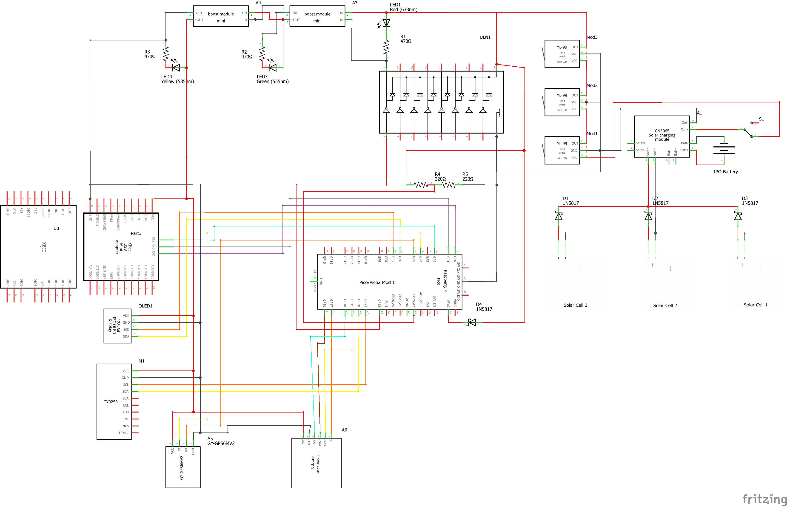

# VyomSat Step 3: EPS + COM + 9-Axis IMU + GPS + Camera Integration

**VyomSat - Essence of Space. Built by You.**

This step builds upon Step 2 (EPS + COM + 9-Axis IMU + GPS) by adding camera capabilities using the ArduCam Mega 3MP SPI camera module. The system now provides complete image capture functionality for Earth observation and visual documentation during CubeSat missions.

## Overview

Step 3 extends the GPS positioning system with camera imaging capabilities. The system continuously measures battery voltage, communicates via UART, provides comprehensive attitude data through the MPU9250 IMU, tracks precise geographic location using GPS satellites, and now captures high-quality images on command.

**New in Step 3:**
- 📷 **ArduCam Mega 3MP Camera** - High-resolution image capture via SPI
- 🖼️ **JPEG Image Capture** - 640x480 resolution with configurable quality
- 💾 **Auto-Incremented Filenames** - Automatic image numbering and storage
- 🎯 **Command 'c'** - Real-time camera capture and image saving
- 📊 **Enhanced Display** - OLED feedback during camera operations
- ⚙️ **Adjustable Settings** - Brightness and contrast configuration

**Retained from Step 2:**
- 🛰️ NEO-6M GPS Module with position tracking
- 📍 Location Data (latitude, longitude, altitude)
- 🕐 GPS Time & Date with timezone conversion
- 🎯 Command 'g' for GPS data capture

**Retained from Step 1:**
- 🧭 MPU9250 9-Axis IMU (accelerometer, gyroscope, magnetometer)
- 📊 Attitude Data (pitch, roll, heading)
- 🎯 Command 'a' for 9-axis data capture

**Retained from Step 0:**
- 📊 Battery Voltage Monitoring
- 📺 OLED Display (128x64 SSD1306)
- 📡 UART Communication (XBee)
- 🎛️ Command Interface
- ⚡ Hardware Reset Management

## Features

### Camera Imaging Capabilities

The ArduCam Mega 3MP camera module provides complete image capture:

- **Image Capture**: High-quality JPEG images
  - Resolution: 640x480 pixels (VGA)
  - Sensor: OV5642 CMOS 3MP
  - Format: JPEG compression for efficient storage
  - Auto-incremented filenames: vyomsat_image_001.jpg, vyomsat_image_002.jpg, etc.

- **Image Quality Control**: Adjustable settings
  - Brightness: Configurable levels (default: BRIGHTNESS_PLUS_4)
  - Contrast: Configurable levels (default: CONTRAST_MINUS_3)
  - Color correction: 3-second delay to remove green hue

- **SPI Communication**: High-speed data transfer
  - SPI Bus 0: 8 MHz communication speed
  - 4-wire interface: SCK, MISO, MOSI, CS
  - Dedicated chip select for camera control

- **Storage Management**: Automatic file handling
  - Auto-incremented filenames prevent overwrites
  - Progress bar during image save
  - File manager handles filename generation

### Camera Integration Features

- **Command-Triggered Capture**: Camera capture via command 'c'
- **OLED Status Display**: Real-time feedback during capture
- **UART Acknowledgments**: ACK/NAK responses for success/failure
- **USB Console Logging**: Detailed capture status messages
- **Error Handling**: Graceful degradation if camera unavailable
- **Multi-Screen Feedback**: OLED shows capture progress and results

## Hardware Requirements

### Components

- Raspberry Pi Pico 2 or Pico W
- SSD1306 OLED Display (128x64 pixels, I2C)
- MPU9250 9-Axis IMU Sensor Module (I2C)
- NEO-6M GPS Module (UART)
- **ArduCam Mega 3MP SPI Camera Module (OV5642)** ← **NEW**
- XBee module (or compatible UART device)
- Battery voltage divider circuit
- 4.7kΩ pull-up resistors for I2C lines (2x for IMU)

### Wiring Connections

| Component | Pico Pin | Description |
|-----------|----------|-------------|
| **OLED Display** | | |
| SCL | GP7 | I2C Serial Clock |
| SDA | GP6 | I2C Serial Data |
| VCC | 3.3V | Power |
| GND | GND | Ground |
| **MPU9250 9-Axis IMU** | | |
| SCL | GP21 | I2C Serial Clock |
| SDA | GP20 | I2C Serial Data |
| VCC | 3.3V | Power |
| GND | GND | Ground |
| **NEO-6M GPS Module** | | |
| TX (GPS → Pico) | GP5 | UART1 Receive |
| RX (Pico → GPS) | GP4 | UART1 Transmit |
| VCC | 3.3V | Power |
| GND | GND | Ground |
| **ArduCam Mega 3MP** | | **NEW** |
| SCK | GP18 | SPI Serial Clock |
| MISO | GP16 | SPI Master In Slave Out |
| MOSI | GP19 | SPI Master Out Slave In |
| CS | GP17 | SPI Chip Select |
| VCC | 3.3V or 5V | Power (check module specs) |
| GND | GND | Ground |
| **XBee Module** | | |
| TX (Pico → XBee) | GP0 | UART0 Transmit |
| RX (XBee → Pico) | GP1 | UART0 Receive |
| RST | GP2 | Hardware Reset (optional) |
| GND | GND | Common Ground |
| **Battery Sensing** | | |
| ADC Input | GP28 | Battery voltage via divider |

> **Important Notes**: 
> - The ArduCam Mega uses SPI communication at 8 MHz
> - Camera requires 3-second initialization delay for color correction
> - Images are saved to Pico's internal flash storage
> - SPI Bus 0 (GP16/GP17/GP18/GP19) is dedicated to camera
> - UART1 (GP4/GP5) remains for GPS communication
> - UART0 (GP0/GP1) remains for XBee communication
> - The MPU9250 requires 4.7kΩ pull-up resistors on both SCL and SDA lines
> - Battery voltage must be reduced to 0-3.3V range using a voltage divider circuit

### Circuit Diagrams

Visual references for hardware setup are provided using Fritzing diagrams:

#### Schematic Diagram


The schematic shows the complete electrical connections including:
- Solar panel array with charge controller (CN3065)
- Multiple power rails (3.3V, 5V) with boost/buck converters
- Raspberry Pi Pico/Pico2 connections
- OLED display I2C interface (GP6/GP7)
- MPU9250 9-axis IMU I2C interface (GP20/GP21)
- NEO-6M GPS module UART1 interface (GP4/GP5)
- ArduCam Mega 3MP SPI interface (GP16/GP17/GP18/GP19)
- XBee communication module on UART0 (GP0/GP1)
- Battery voltage sensing circuit
- LED status indicators
- Limit switches for mission control
- Power management components

#### Breadboard Layout


The breadboard layout provides a practical wiring guide showing:
- Physical component placement
- Wire routing and connections
- Power distribution
- Module interconnections
- Camera module positioning and SPI connections
- GPS module with antenna

#### Bill of Materials (BOM)
A complete parts list with quantities and specifications is available: **[camera_bom.html](camera_bom.html)**

The BOM includes all components from Steps 0, 1, and 2 plus:
- ArduCam Mega 3MP SPI Camera Module (OV5642)
- 34.5mm x 34.5mm x 16.5mm form factor
- 68.75° diagonal field of view
- All resistors, capacitors, ICs, and modules required

> **Fritzing Software**: These diagrams were created using [Fritzing](https://fritzing.org/), an open-source electronics design tool. Download from [fritzing.org/download](https://fritzing.org/download/) to view or modify the designs.

## Architecture

The system builds on Step 2's modular architecture with new camera capabilities:

### New Module: `vyomsat_camera_manager.py`
Handles ArduCam Mega 3MP camera operations and image capture.

**Key Functions:**
- `initialize_camera()`: Initializes camera with SPI configuration and settings
- `capture_camera_image(base_filename)`: Captures JPEG image with auto-incremented filename
- `capture_and_display_image(uart_handler, oled_manager, base_filename)`: Complete capture with OLED feedback
- `is_camera_available()`: Checks if camera is initialized and ready

**How it works:**
- Initializes SPI Bus 0 for camera communication (8 MHz on GPIO 16/17/18/19)
- Creates Camera and FileManager instances for image capture
- Configures camera resolution (640x480), brightness, and contrast
- Waits 3 seconds after initialization to remove green hue (per ArduCam docs)
- Captures JPEG images on command with progress bar
- Auto-increments filenames to prevent overwrites
- Provides OLED feedback during capture process
- Sends ACK/NAK responses via UART

**OLED Display Feedback:**
When command 'c' is received, the system provides visual feedback:
1. **Capturing Screen**: "Camera" / "Capturing..." (brief)
2. **Success Screen**: "Camera OK!" / "Image saved:" / filename (3 seconds)
3. **Error Screen**: "Camera Error!" / error message (2 seconds)

**Camera Settings:**
- Resolution: 640x480 (VGA)
- Brightness: BRIGHTNESS_PLUS_4 (adjustable)
- Contrast: CONTRAST_MINUS_3 (adjustable)
- SPI Speed: 8 MHz
- Format: JPEG compressed

### Updated: `vyomsat.py`
Main integration module extended with camera support.

**Changes from Step 2:**
- Added camera sensor initialization in `main()` function
- Updated command 'c' handler to call `capture_and_display_image()`
- Added 1-second pause after camera capture before returning to telemetry
- Enhanced error handling for camera unavailability
- Graceful degradation if camera not available
- Documentation updated for camera sensor integration

**Operational Flow:**
```
┌─────────────────────────────────────────────┐
│ 1. Initialize Hardware                      │
│    - LED & GPIO pins                        │
│    - XBee hardware reset                    │
│    - Battery ADC sensor                     │
│    - 9-Axis IMU sensor                      │
│    - GPS sensor                             │
│    - Camera sensor (NEW)                    │
│    - OLED display                           │
│    - UART communication                     │
└─────────────────────────────────────────────┘
                    ↓
┌─────────────────────────────────────────────┐
│ 2. Main Loop (every 4 seconds)             │
│    ┌─────────────────────────────────────┐ │
│    │ a. Read GPS data (non-blocking)     │ │
│    │ b. Read battery voltage             │ │
│    │ c. Get basic GPS data               │ │
│    │ d. Update OLED with GPS + HK        │ │
│    │ e. Send telemetry via UART (w/ GPS) │ │
│    │ f. Process incoming UART commands   │ │
│    │    - Command 'c': Camera capture    │ │ ← NEW
│    │ g. Print status to USB console      │ │
│    └─────────────────────────────────────┘ │
└─────────────────────────────────────────────┘
```

### Retained Modules from Previous Steps

**`vyomsat_gps_manager.py`**: NEO-6M GPS sensor management (Step 2)  
**`vyomsat_9axis_manager.py`**: MPU9250 9-axis IMU sensor management (Step 1)  
**`vyomsat_battery_manager.py`**: Battery voltage sensing via ADC (Step 0)  
**`vyomsat_oled_manager.py`**: SSD1306 OLED display management (Step 0)  
**`vyomsat_xbee_manager.py`**: XBee hardware reset handling (Step 0)

## Telemetry Output

### USB Serial Console - Normal Operation
```
[12345ms] Telemetry Sent | V: 6.90V | GPS: 25.2521, 55.3095 | Alt: 15.2m | Sats: 8 | Counter: 42
```

### USB Serial Console - Camera Capture (Command 'c')
```
UART Command Received: 'c' (ASCII: 99)
Processing camera image capture...
USB Response: Command 'c' received: Camera capture initiated
[INFO] Starting camera capture...
[INFO] Image captured, processing...
[INFO] Saving image as 'vyomsat_image_003.jpg'...
[OK] Image saved as vyomsat_image_003.jpg
[OK] Camera capture SUCCESS: Image saved as vyomsat_image_003.jpg
UART Response sent: 'ACK: Image saved as vyomsat_image_003.jpg' (45 bytes)
```

### USB Serial Console - Camera Error (Camera Not Available)
```
UART Command Received: 'c' (ASCII: 99)
Processing camera image capture...
USB Response: Command 'c' received: Camera capture initiated
[ERROR] Camera capture FAILED: Camera not initialized
UART Response sent: 'NAK: Camera not available' (27 bytes)
```

### UART (XBee) - Camera Capture Success
```
ACK: Image saved as vyomsat_image_003.jpg
```

### UART (XBee) - Camera Capture Failure
```
NAK: Camera not available
```

### OLED Display - Camera Capture (Success)
```
Camera OK!
Image saved:
vyomsat_image_003
```
(Displayed for 3 seconds, then returns to normal telemetry)

### OLED Display - Camera Capture (Failure)
```
Camera Error!
Not initialized
```
(Displayed for 2 seconds, then returns to normal telemetry)

### OLED Display - Normal Operation
```
VyomSat EPS+GPS
00:05:42
V: 6.90V
Lat:25.2521° N
Lon:55.3095° E
```

## Supported UART Commands

Send single character commands to control the system:

| Command | Function | Response | Status |
|---------|----------|----------|--------|
| `c` | **Camera image capture** | Image saved with filename | **NEW** ✨ |
| `g` | GPS position data | Comprehensive GPS diagnostics | Active |
| `a` | 9-axis IMU attitude data | Comprehensive sensor data | Active |
| `v` | Request voltage reading | Detailed voltage data | Active |
| `b` | System reset | ACK (placeholder) | Reserved |
| `s` | SD card logging | ACK (placeholder) | Reserved |

### Command 'c' - Camera Image Capture (NEW)

**Behavior:**
1. Checks if camera is initialized and available
2. Displays "Capturing..." on OLED
3. Captures JPEG image from camera sensor
4. Waits 3 seconds for color correction
5. Saves image with auto-incremented filename
6. Shows progress bar during save operation
7. Displays success/failure on OLED (2-3 seconds)
8. Sends ACK/NAK response via UART
9. Returns to normal telemetry display

**Example:**
```
Send: c

Receive (UART): ACK: Camera capture initiated
                ACK: Image saved as vyomsat_image_003.jpg

Display (OLED): [Camera capture sequence with feedback]

Storage: vyomsat_image_003.jpg saved to flash
```

**Camera Capture Process:**
1. Command 'c' received via UART
2. Camera availability checked
3. OLED shows "Capturing..."
4. Camera captures JPEG image
5. 3-second delay for color correction
6. Image saved with progress bar
7. OLED shows "Camera OK!" + filename
8. UART sends ACK with filename
9. 1-second pause before returning to telemetry

### Command 'g' - GPS Position Data

**Example:**
```
Send: g

Receive: ACK: GPS capture initiated
         [comprehensive GPS data follows]
```

### Command 'a' - 9-Axis Attitude Data

**Example:**
```
Send: a

Receive: ACK: MPU9250 capture initiated
         [comprehensive 9-axis IMU data follows]
```

### Command 'v' - Voltage Reading

**Example:**
```
Send: v

Receive: ACK: Battery voltage reading initiated
         [timestamp] BATTERY VOLTAGE | Batt: 6.900V | ADC: 3.450V | Raw: 32768
```

## Usage

### 1. Setup Hardware
Connect all components according to the wiring table above. Pay special attention to:
- ArduCam Mega 3MP on SPI Bus 0 (GP16/17/18/19)
- Camera power supply (3.3V or 5V depending on module)
- NEO-6M GPS module on UART1 (GP4 TX, GP5 RX)
- 4.7kΩ pull-up resistors on MPU9250 I2C lines (SCL and SDA)
- Separate I2C buses for OLED (GP6/7) and IMU (GP20/21)
- Common ground connections for all modules

### 2. Get Required Libraries

The manager modules depend on sensor and breakout board libraries from the [OjasJha/micropython-lib](https://github.com/OjasJha/micropython-lib.git) repository.

Clone or download the repository:
```bash
git clone https://github.com/OjasJha/micropython-lib.git
```

**Required libraries for Step 3:**

*From Step 0:*
- `com/uart/uart_handler.py` - UART communication handler

*From Step 1:*
- `io/oled-ssd1306/ssd1306_handler.py` - SSD1306 OLED display driver
- `sensors/mpu9250/mpu9250_handler.py` - MPU9250 9-axis IMU handler
- `sensors/mpu9250/mpu6500_handler.py` - MPU6500 6-axis IMU handler
- `sensors/mpu9250/ak8963_handler.py` - AK8963 3-axis magnetometer handler
- `sensors/mpu9250/mpu9250.py` - Low-level MPU9250 driver
- `sensors/mpu9250/mpu6500.py` - Low-level MPU6500 driver
- `sensors/mpu9250/ak8963.py` - Low-level AK8963 driver

*From Step 2:*
- `sensors/gps/neo6mv2_handler.py` - NEO-6M GPS handler with NMEA parsing

*NEW for Step 3:*
- `io/camera/camera_handler.py` - ArduCam Mega camera handler with JPEG capture
- `io/camera/file_manager.py` - File manager for auto-incremented filenames (may be part of camera_handler)

> **Important**: Copy these library files directly to the same folder as the VyomSat modules (flat structure). Do NOT maintain the directory structure from the repository.

### 3. Upload Code

Copy all Python files to your Raspberry Pi Pico in the **same folder**:

**VyomSat Step 3 Modules:**
- `vyomsat.py` (updated)
- `vyomsat_battery_manager.py`
- `vyomsat_oled_manager.py`
- `vyomsat_xbee_manager.py`
- `vyomsat_9axis_manager.py`
- `vyomsat_gps_manager.py`
- `vyomsat_camera_manager.py` ← **NEW**

**Libraries from micropython-lib repository:**
- `uart_handler.py` (from `com/uart/`)
- `ssd1306_handler.py` (from `io/oled-ssd1306/`)
- `mpu9250_handler.py` (from `sensors/mpu9250/`)
- `mpu6500_handler.py` (from `sensors/mpu9250/`)
- `ak8963_handler.py` (from `sensors/mpu9250/`)
- `mpu9250.py` (from `sensors/mpu9250/`)
- `mpu6500.py` (from `sensors/mpu9250/`)
- `ak8963.py` (from `sensors/mpu9250/`)
- `neo6mv2_handler.py` (from `sensors/gps/`)
- `camera_handler.py` (from `io/camera/`) ← **NEW**

All files should be in the root directory of your Pico, or in the same folder.

### 4. Run
```python
# On Pico - execute main script
python vyomsat.py
```

Or set it as `main.py` to run automatically on boot.

### 5. Monitor & Test

**Startup:**
1. Watch USB console for initialization messages
2. Verify camera initialization: `[OK] Camera initialized successfully!`
3. Verify GPS initialization: `[OK] GPS sensor initialized on UART1`
4. Verify 9-axis IMU initialization: `[OK] 9-axis IMU sensor initialized successfully!`
5. Check OLED display shows normal telemetry

**Camera Testing:**
1. Wait for system to fully initialize
2. Send 'c' via UART (XBee)
3. Observe USB console for capture process
4. Watch OLED display for capture feedback
5. Receive ACK with filename via UART
6. Verify image file created on Pico flash storage

**Test Command 'c':**
1. Send 'c' via UART
2. Watch OLED show "Capturing..."
3. Observe USB console logging capture process
4. OLED displays success with filename (3 seconds)
5. Receive ACK via UART with filename
6. Capture multiple images to verify auto-increment
7. Check filenames: vyomsat_image_001.jpg, vyomsat_image_002.jpg, etc.

**Normal Operation:**
- **USB Console**: Monitor debug output with telemetry and camera status (115200 baud)
- **OLED**: View real-time telemetry (battery, GPS position)
- **XBee**: Receive telemetry stream and send commands
- **Camera**: Capture images on demand via command 'c'

## Configuration

Key constants in `vyomsat.py`:

```python
# OLED Display
OLED_SCL_PIN = 7              # I2C clock pin
OLED_SDA_PIN = 6              # I2C data pin

# Battery Monitoring
BATTERY_ADC_CHANNEL = 2                    # ADC2 (GP28)
BATTERY_VOLTAGE_DIVIDER_FACTOR = 0.5       # 2:1 voltage divider

# UART Communication (XBee)
UART_BAUDRATE = 9600          # Standard XBee baudrate
UART_TX_PIN = 0               # GP0
UART_RX_PIN = 1               # GP1

# XBee Reset
XBEE_RESET_PIN = 2            # GP2
XBEE_INIT_DELAY_SECONDS = 5   # Boot delay

# 9-Axis IMU Sensor
NINE_AXIS_SCL_PIN = 21        # GPIO 21 for I2C Serial Clock
NINE_AXIS_SDA_PIN = 20        # GPIO 20 for I2C Serial Data
NINE_AXIS_I2C_FREQ = 400000   # I2C bus frequency (400kHz)

# GPS Sensor
GPS_UART_ID = 1               # UART1 interface
GPS_TX_PIN = 4                # GPIO 4 for UART1 TX
GPS_RX_PIN = 5                # GPIO 5 for UART1 RX
GPS_BAUDRATE = 9600           # NEO-6M default baudrate
GPS_TIMEZONE_OFFSET = 4       # Dubai/UAE timezone (UTC+4)

# Telemetry Rate
MAIN_LOOP_DELAY_SECONDS = 4   # Update interval
```

Key constants in `vyomsat_camera_manager.py`:

```python
# SPI Bus Configuration
SPI_BUS_ID = 0
SPI_SCK_PIN = 18              # Serial Clock (GP18)
SPI_MISO_PIN = 16             # Master In Slave Out (GP16)
SPI_MOSI_PIN = 19             # Master Out Slave In (GP19)
SPI_BAUDRATE = 8000000        # 8 MHz

# Camera Chip Select Pin
CAMERA_CS_PIN = 17            # Chip Select (GP17)

# Image Resolution
DEFAULT_RESOLUTION = '640x480'

# Image Quality Settings
CAMERA_BRIGHTNESS = 'BRIGHTNESS_PLUS_4'
CAMERA_CONTRAST = 'CONTRAST_MINUS_3'

# Timing
CAMERA_INIT_DELAY_MS = 3000   # 3-second color correction delay

# File Management
DEFAULT_IMAGE_BASENAME = 'vyomsat_image'
```

## Understanding Camera Operation

### Image Capture Process

The ArduCam Mega captures images through several stages:

| Stage | Duration | Action | Purpose |
|-------|----------|--------|---------|
| **Initialization** | 3 seconds | Color correction delay | Remove green hue |
| **Capture** | < 1 second | JPEG image capture | Sensor readout |
| **Processing** | 3 seconds | Color correction | Image quality |
| **Storage** | 2-5 seconds | Write to flash | Save with progress bar |

### Image File Management

Images are automatically numbered to prevent overwrites:
- First image: `vyomsat_image_001.jpg`
- Second image: `vyomsat_image_002.jpg`
- Third image: `vyomsat_image_003.jpg`
- And so on...

The FileManager class automatically finds the next available number.

### Camera Settings

| Setting | Value | Purpose |
|---------|-------|---------|
| **Resolution** | 640x480 (VGA) | Balance quality and storage |
| **Format** | JPEG | Compressed for efficient storage |
| **Brightness** | BRIGHTNESS_PLUS_4 | Compensate for lighting |
| **Contrast** | CONTRAST_MINUS_3 | Optimize image clarity |
| **SPI Speed** | 8 MHz | Fast data transfer |

### ArduCam Mega Specifications

- **Image Sensor**: OV5642 CMOS
- **Maximum Resolution**: 3MP (2048x1536)
- **Working Resolution**: 640x480 (VGA) - configurable
- **Interface**: 4-wire SPI
- **SPI Speed**: Up to 8 MHz
- **Field of View**: 68.75° diagonal
- **Focal Length**: 3.3mm
- **Optical Size**: 1/4"
- **Output Formats**: RGB, YUV, JPEG
- **Shutter Type**: Rolling shutter
- **Power Supply**: 3.3V or 5V
- **Power Consumption**: 185mW - 585mW (working)
- **Dimensions**: 34.5mm × 34.5mm × 16.5mm

## Troubleshooting

| Issue | Solution |
|-------|----------|
| **Camera not initializing** | Check wiring (SCK→GP18, MISO→GP16, MOSI→GP19, CS→GP17) |
| | Verify camera module power (3.3V or 5V depending on module) |
| | Check SPI bus not in use by other devices |
| | Ensure camera_handler.py library is uploaded |
| **Green hue in images** | Initialization includes 3-second delay to fix this |
| | If persists, increase CAMERA_INIT_DELAY_MS |
| **Image capture fails** | Check available flash storage space |
| | Verify camera is properly initialized |
| | Ensure FileManager can create files |
| **No ACK received** | Verify UART connection to XBee |
| | Check command 'c' is being received |
| | Monitor USB console for error messages |
| **OLED not updating** | Normal - OLED shows capture status briefly |
| | Returns to telemetry after 3 seconds |
| **Images too dark/bright** | Adjust CAMERA_BRIGHTNESS setting |
| | Modify brightness level in code |
| **Images low contrast** | Adjust CAMERA_CONTRAST setting |
| | Test different contrast levels |
| **SPI errors** | Check wiring integrity |
| | Verify no loose connections |
| | Ensure proper ground reference |
| **GPS still working?** | Yes - GPS continues in background |
| | Camera capture doesn't block GPS |
| **9-axis still working?** | Yes - all subsystems remain operational |
| | Each command operates independently |

## Technical Details

### Communication Interfaces Summary

| Interface | Pins | Speed | Address/Config | Purpose |
|-----------|------|-------|----------------|---------|
| SPI0 | GP16/17/18/19 | 8 MHz | Bus ID 0 | ArduCam Mega camera |
| UART0 | GP0/GP1 | 9600 bps | N81 | XBee communication |
| UART1 | GP4/GP5 | 9600 bps | N81 | GPS module |
| I2C0 | GP6/GP7 | 400 kHz | 0x3C | OLED Display |
| I2C1 | GP20/GP21 | 400 kHz | 0x68, 0x0C | MPU9250 IMU |

### Memory Considerations

- **Image Size**: ~20-50 KB per 640x480 JPEG (varies by content)
- **Flash Storage**: Raspberry Pi Pico has 2 MB flash (Pico 2 has more)
- **Available Space**: After code and MicroPython, ~1-1.5 MB typically available
- **Image Capacity**: Approximately 30-75 images depending on compression
- **Recommendation**: Regularly transfer images off Pico to free space

### Timing in Main Loop

The main loop includes strategic timing to prevent bus contention:
- **100ms delay**: Prevents GPS UART from interfering with I2C
- **1-second pause**: After camera capture before resuming telemetry
- **Camera capture**: Temporarily pauses main loop (5-10 seconds total)

## Changes from Step 2

### Hardware Additions
- ✅ ArduCam Mega 3MP SPI camera module (OV5642)
- ✅ SPI Bus 0 interface (GP16/GP17/GP18/GP19) for camera
- ✅ Chip select line (GP17) for camera control

### Software Additions
- ✅ `vyomsat_camera_manager.py` - New module for camera management
- ✅ ArduCam Mega camera handler library
- ✅ FileManager for auto-incremented filenames
- ✅ Command 'c' implementation for image capture
- ✅ OLED feedback during camera operations
- ✅ Camera initialization with quality settings

### Functional Improvements
- ✅ On-demand image capture via command interface
- ✅ Auto-incremented filename generation
- ✅ JPEG compression for efficient storage
- ✅ Progress bar during image save
- ✅ Real-time OLED feedback for camera status
- ✅ ACK/NAK responses via UART
- ✅ Graceful degradation when camera unavailable
- ✅ Comprehensive USB console logging for camera operations

## Testing Procedure

### 1. Hardware Verification
- [ ] All connections secure and correct
- [ ] Camera module positioned properly
- [ ] Camera power supply stable (3.3V or 5V)
- [ ] SPI wiring verified (SCK, MISO, MOSI, CS)
- [ ] Common ground connected to all modules

### 2. Software Verification
- [ ] All required libraries uploaded to Pico
- [ ] camera_handler.py present on Pico
- [ ] Main script runs without errors
- [ ] USB console shows successful initialization

### 3. Camera Initialization Testing
- [ ] Camera initialization message: `[OK] Camera initialized successfully!`
- [ ] No SPI errors during startup
- [ ] Camera settings configured properly
- [ ] FileManager initialized successfully

### 4. Command 'c' Testing
- [ ] Send 'c' via UART
- [ ] USB console shows capture process
- [ ] UART receives ACK with filename
- [ ] OLED shows capture feedback sequence
- [ ] Image file created on Pico
- [ ] Filename increments correctly

### 5. Image Quality Testing
- [ ] Images have correct resolution (640x480)
- [ ] No green hue present in images
- [ ] Brightness level appropriate
- [ ] Contrast level acceptable
- [ ] JPEG compression working
- [ ] File sizes reasonable (~20-50 KB)

### 6. Multi-Capture Testing
- [ ] Capture multiple images sequentially
- [ ] Filenames increment properly (001, 002, 003...)
- [ ] No file overwrites occur
- [ ] System stable across multiple captures
- [ ] Storage space monitored

### 7. Integration Testing
- [ ] Battery voltage displays correctly
- [ ] GPS continues working during camera operations
- [ ] 9-axis IMU commands still functional
- [ ] OLED returns to telemetry after capture
- [ ] UART telemetry resumes normally
- [ ] All subsystems work together without conflicts

### 8. Error Handling Testing
- [ ] Camera unavailable handled gracefully
- [ ] NAK sent when camera not initialized
- [ ] Error messages displayed on OLED
- [ ] System continues operating if camera fails
- [ ] USB console shows meaningful error messages

## License

MIT License - Copyright (c) 2025 Ojas Jha

See individual Python files for full license text.

## Author

**Ojas Jha**  
VyomSat CubeSat Education Kit  
Date: October 25, 2025

## Acknowledgments

- Step 0 (EPS + COM), Step 1 (9-Axis IMU), and Step 2 (GPS) provide the foundation
- ArduCam Mega 3MP camera module with OV5642 CMOS sensor
- Camera handler library based on ArduCam MicroPython drivers
- 3-second initialization delay recommendation from ArduCam forum
- Fritzing diagrams created with Fritzing open-source software

## References

- ArduCam Mega MicroPython Driver: https://forum.arducam.com/t/mega-3mp-micropython-driver/5708
- OV5642 Sensor Datasheet
- Raspberry Pi Pico SPI Documentation
- MicroPython SPI Class Reference

