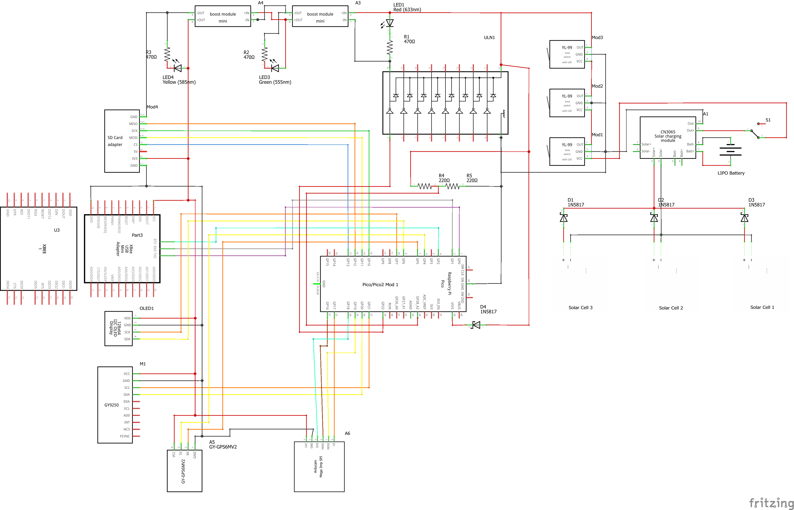
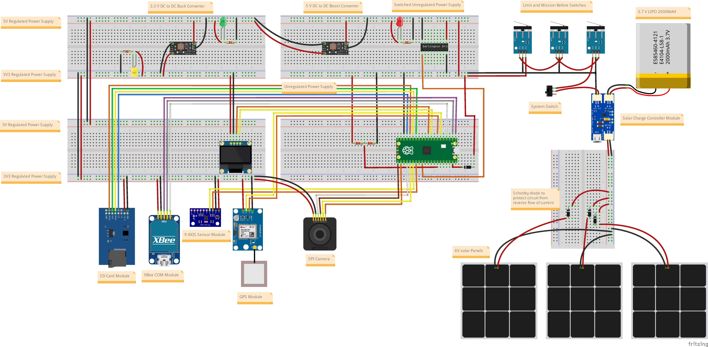

# VyomSat Step 4: EPS + COM + 9-Axis IMU + GPS + Camera + SD Card Integration

**VyomSat - Essence of Space. Built by You.**

This step builds upon Step 3 (EPS + COM + 9-Axis IMU + GPS + Camera) by adding SD card data logging capabilities. The system now provides comprehensive data storage for all sensor telemetry, enabling long-term mission data recording and analysis.

## Overview

Step 4 extends the camera imaging system with SD card storage for comprehensive sensor data logging. The system continuously measures battery voltage, communicates via UART, provides comprehensive attitude data through the MPU9250 IMU, tracks precise geographic location using GPS satellites, captures high-quality images on command, and now logs all sensor data to SD card for later analysis.

**New in Step 4:**
- 💾 **Micro SD Card Module** - SPI-based data logging to SD card
- 📝 **Multi-Sensor Data Logging** - Records housekeeping, 9-axis IMU, and GPS data
- 🔄 **Multi-Cycle Capture** - Collects data over 5 cycles with configurable timing
- 📊 **Timestamped Log Files** - Auto-generated filenames with Unix timestamps
- 🎯 **Command 's'** - Real-time sensor data logging to SD card
- 📺 **Enhanced Display** - OLED feedback during logging operations
- 💿 **FAT32 Filesystem** - Standard SD/SDHC card support (up to 32GB)

**Retained from Step 3:**
- 📷 ArduCam Mega 3MP Camera with JPEG capture
- 🖼️ Auto-incremented image filenames
- 🎯 Command 'c' for camera capture

**Retained from Step 2:**
- 🛰️ NEO-6M GPS Module with position tracking
- 📍 Location Data (latitude, longitude, altitude)
- 🕐 GPS Time & Date with timezone conversion
- 🎯 Command 'g' for GPS data capture

**Retained from Step 1:**
- 🧭 MPU9250 9-Axis IMU (accelerometer, gyroscope, magnetometer)
- 📊 Attitude Data (pitch, roll, heading)
- 🎯 Command 'a' for 9-axis data capture

**Retained from Step 0:**
- 📊 Battery Voltage Monitoring
- 📺 OLED Display (128x64 SSD1306)
- 📡 UART Communication (XBee)
- 🎛️ Command Interface
- ⚡ Hardware Reset Management

## Features

### SD Card Data Logging Capabilities

The Micro SD Card module provides comprehensive data storage:

- **Multi-Sensor Data Logging**: Comprehensive telemetry capture
  - Housekeeping Data: Battery voltage, timestamps, system uptime
  - 9-Axis IMU Data: Accelerometer, gyroscope, magnetometer, attitude, heading
  - GPS Data: Position, altitude, time, satellites, motion, fix quality
  - Multi-cycle collection: 5 cycles by default (configurable)
  - Cycle timing: 500ms delay between cycles (configurable)

- **File Management**: Automatic timestamped logs
  - Auto-generated filenames: sensor_log_[timestamp].txt
  - Unix timestamp for unique identification
  - Organized text format for easy parsing
  - Complete header and footer sections

- **SPI Communication**: High-speed SD card access
  - SPI Bus 1: 1 MHz communication speed (safe initialization)
  - 4-wire interface: SCK, MISO, MOSI, CS
  - Dedicated chip select for SD card control
  - FAT filesystem mounting

- **Card Compatibility**: Wide range of SD cards
  - SDSC (Standard Capacity): Up to 2GB, FAT16
  - SDHC (High Capacity): 2GB to 32GB, FAT32
  - Recommended: FAT32 formatted cards

### SD Card Integration Features

- **Command-Triggered Logging**: Data logging via command 's'
- **OLED Status Display**: Real-time feedback during logging
- **UART Acknowledgments**: ACK/NAK responses for success/failure
- **USB Console Logging**: Detailed logging status messages
- **Error Handling**: Graceful degradation if SD card unavailable
- **Multi-Screen Feedback**: OLED shows logging progress and results

### Data Log Format

Each log file contains comprehensive sensor data organized by cycle:

```
======================================================================
VyomSat Sensor Data Log
======================================================================
Log created: [Unix timestamp]
Number of cycles: 5
======================================================================

=== CYCLE 1 - HOUSEKEEPING DATA ===
Timestamp: [ms]
Time: HH:MM:SS
Battery Voltage: X.XX V

=== CYCLE 1 - MPU9250 9-AXIS IMU DATA ===
Timestamp: [ms]
Temperature: XX.XX C

ACCELEROMETER (m/s^2):
  X: X.XXX  Y: X.XXX  Z: X.XXX
  Magnitude: X.XXX m/s^2

GYROSCOPE (deg/s):
  X: X.XX  Y: X.XX  Z: X.XX
  Magnitude: X.XX deg/s

MAGNETOMETER (uT):
  X: X.XX  Y: X.XX  Z: X.XX
  Magnitude: X.XX uT

ATTITUDE (FILTERED):
  Pitch: X.XX deg
  Roll:  X.XX deg
  Heading: X.X deg (Magnetic North)

=== CYCLE 1 - GPS DATA ===

POSITION:
  Latitude: XX.XXXX° N/S
  Longitude: XX.XXXX° E/W
  Altitude: XXX.X m
  Geoid Height: XX.X m

TIME & DATE:
  GPS Time (local): HH:MM:SS.SS
  Date: DD/MM/YYYY
  Timezone Offset: +X h

MOTION:
  Course/Heading: XXX.X deg
  Compass Direction: [N/S/E/W/NE/etc]
  Speed (km/h): XX.XX km/h
  Speed (knots): XX.XX knots

SATELLITES:
  In View: XX
  In Use: XX
  Used IDs: [list]

FIX QUALITY:
  Fix Status (GGA): [status]
  Fix Type (GSA): [type]
  HDOP: X.XX
  VDOP: X.XX
  PDOP: X.XX

----------------------------------------------------------------------

[Cycles 2-5 repeat the same structure]

======================================================================
End of Log
======================================================================
```

## Hardware Requirements

### Components

- Raspberry Pi Pico 2 or Pico W
- SSD1306 OLED Display (128x64 pixels, I2C)
- MPU9250 9-Axis IMU Sensor Module (I2C)
- NEO-6M GPS Module (UART)
- ArduCam Mega 3MP SPI Camera Module (OV5642)
- **Micro SD Card Module (SPI)** ← **NEW**
- **Micro SD Card (FAT32, up to 32GB)** ← **NEW**
- XBee module (or compatible UART device)
- Battery voltage divider circuit
- 4.7kΩ pull-up resistors for I2C lines (2x for IMU)

### Wiring Connections

| Component | Pico Pin | Description |
|-----------|----------|-------------|
| **OLED Display** | | |
| SCL | GP7 | I2C Serial Clock |
| SDA | GP6 | I2C Serial Data |
| VCC | 3.3V | Power |
| GND | GND | Ground |
| **MPU9250 9-Axis IMU** | | |
| SCL | GP21 | I2C Serial Clock |
| SDA | GP20 | I2C Serial Data |
| VCC | 3.3V | Power |
| GND | GND | Ground |
| **NEO-6M GPS Module** | | |
| TX (GPS → Pico) | GP5 | UART1 Receive |
| RX (Pico → GPS) | GP4 | UART1 Transmit |
| VCC | 3.3V | Power |
| GND | GND | Ground |
| **ArduCam Mega 3MP** | | |
| SCK | GP18 | SPI0 Serial Clock |
| MISO | GP16 | SPI0 Master In Slave Out |
| MOSI | GP19 | SPI0 Master Out Slave In |
| CS | GP17 | SPI0 Chip Select |
| VCC | 3.3V or 5V | Power (check module specs) |
| GND | GND | Ground |
| **Micro SD Card Module** | | **NEW** |
| SCK | GP10 | SPI1 Serial Clock |
| MISO | GP12 | SPI1 Master In Slave Out |
| MOSI | GP11 | SPI1 Master Out Slave In |
| CS | GP13 | SPI1 Chip Select |
| VCC | 3.3V or 5V | Power (module has regulator) |
| GND | GND | Ground |
| **XBee Module** | | |
| TX (Pico → XBee) | GP0 | UART0 Transmit |
| RX (XBee → Pico) | GP1 | UART0 Receive |
| RST | GP2 | Hardware Reset (optional) |
| GND | GND | Common Ground |
| **Battery Sensing** | | |
| ADC Input | GP28 | Battery voltage via divider |

> **Important Notes**: 
> - The SD Card Module uses SPI1 communication at 1 MHz (safe initialization speed)
> - SD card should be formatted as FAT32 for best compatibility
> - SPI Bus 0 (GP16/GP17/GP18/GP19) is dedicated to camera
> - SPI Bus 1 (GP10/GP11/GP12/GP13) is dedicated to SD card
> - UART1 (GP4/GP5) remains for GPS communication
> - UART0 (GP0/GP1) remains for XBee communication
> - The MPU9250 requires 4.7kΩ pull-up resistors on both SCL and SDA lines
> - Battery voltage must be reduced to 0-3.3V range using a voltage divider circuit
> - SD card module typically includes level shifters for 5V compatibility

### Circuit Diagrams

Visual references for hardware setup are provided using Fritzing diagrams:

#### Schematic Diagram


The schematic shows the complete electrical connections including:
- Solar panel array with charge controller (CN3065)
- Multiple power rails (3.3V, 5V) with boost/buck converters
- Raspberry Pi Pico/Pico2 connections
- OLED display I2C interface (GP6/GP7)
- MPU9250 9-axis IMU I2C interface (GP20/GP21)
- NEO-6M GPS module UART1 interface (GP4/GP5)
- ArduCam Mega 3MP SPI0 interface (GP16/GP17/GP18/GP19)
- Micro SD Card Module SPI1 interface (GP10/GP11/GP12/GP13)
- XBee communication module on UART0 (GP0/GP1)
- Battery voltage sensing circuit
- LED status indicators
- Limit switches for mission control
- Power management components

#### Breadboard Layout


The breadboard layout provides a practical wiring guide showing:
- Physical component placement
- Wire routing and connections
- Power distribution
- Module interconnections
- Camera module positioning and SPI0 connections
- SD card module positioning and SPI1 connections
- GPS module with antenna

#### Bill of Materials (BOM)
A complete parts list with quantities and specifications is available: **[sd_bom.html](sd_bom.html)**

The BOM includes all components from Steps 0, 1, 2, and 3 plus:
- Micro SD Card Module with SPI interface
- Level conversion support (5V or 3.3V)
- 42mm × 24mm × 12mm form factor
- Supports Micro SD (≤2GB) and Micro SDHC (≤32GB) cards
- All resistors, capacitors, ICs, and modules required

> **Fritzing Software**: These diagrams were created using [Fritzing](https://fritzing.org/), an open-source electronics design tool. Download from [fritzing.org/download](https://fritzing.org/download/) to view or modify the designs.

## Architecture

The system builds on Step 3's modular architecture with new SD card capabilities:

### New Module: `vyomsat_sd_manager.py`
Handles Micro SD Card data logging and filesystem operations.

**Key Functions:**
- `initialize_sd_card()`: Initializes SD card with SPI configuration and mounts filesystem
- `log_sensor_data_to_sd()`: Logs comprehensive sensor data for specified number of cycles
- `log_and_display_sensor_data()`: Complete logging with OLED feedback and UART responses
- `is_sd_card_available()`: Checks if SD card is initialized and available
- `format_housekeeping_data()`: Formats battery and timestamp data for logging
- `format_9axis_data_for_logging()`: Formats MPU9250 IMU data for logging
- `format_gps_data_for_logging()`: Formats NEO-6M GPS data for logging

**How it works:**
- Initializes SPI Bus 1 for SD card communication (1 MHz on GPIO 10/11/12/13)
- Creates SD card driver and mounts FAT filesystem at `/sd`
- Generates timestamped filenames: `sensor_log_[timestamp].txt`
- Collects data over multiple cycles (default: 5 cycles, 500ms apart)
- Formats comprehensive sensor data in human-readable text format
- Writes organized log file with headers, data sections, and footers
- Provides OLED feedback during logging process
- Sends ACK/NAK responses via UART

**OLED Display Feedback:**
When command 's' is received, the system provides visual feedback:
1. **Logging Screen**: "SD Card" / "Logging..." / "X cycles" (during capture)
2. **Success Screen**: "SD Logging OK!" / "Data saved:" / filename (3 seconds)
3. **Error Screen**: "SD Error!" / error message (2 seconds)

**SD Card Settings:**
- SPI Bus: SPI1 (ID 1)
- Baudrate: 1 MHz (safe initialization speed)
- Polarity: 0 (clock idle LOW)
- Phase: 0 (data sampled on rising edge)
- Mount Point: `/sd`
- Filesystem: FAT16/FAT32

### Updated: `vyomsat.py`
Main integration module extended with SD card support.

**Changes from Step 3:**
- Added SD card sensor initialization in `main()` function
- Updated command 's' handler to call `log_and_display_sensor_data()`
- Added 1-second pause after SD logging before returning to telemetry
- Enhanced error handling for SD card unavailability
- Graceful degradation if SD card not available
- Documentation updated for SD card integration

**Operational Flow:**
```
┌─────────────────────────────────────────────┐
│ 1. Initialize Hardware                      │
│    - LED & GPIO pins                        │
│    - XBee hardware reset                    │
│    - Battery ADC sensor                     │
│    - 9-Axis IMU sensor                      │
│    - GPS sensor                             │
│    - Camera sensor                          │
│    - SD card module (NEW)                   │
│    - OLED display                           │
│    - UART communication                     │
└─────────────────────────────────────────────┘
                    ↓
┌─────────────────────────────────────────────┐
│ 2. Main Loop (every 4 seconds)             │
│    ┌─────────────────────────────────────┐ │
│    │ a. Read GPS data (non-blocking)     │ │
│    │ b. Read battery voltage             │ │
│    │ c. Get basic GPS data               │ │
│    │ d. Update OLED with GPS + HK        │ │
│    │ e. Send telemetry via UART (w/ GPS) │ │
│    │ f. Process incoming UART commands   │ │
│    │    - Command 's': SD card logging   │ │ ← NEW
│    │ g. Print status to USB console      │ │
│    └─────────────────────────────────────┘ │
└─────────────────────────────────────────────┘
```

### Retained Modules from Previous Steps

**`vyomsat_camera_manager.py`**: ArduCam Mega camera management (Step 3)  
**`vyomsat_gps_manager.py`**: NEO-6M GPS sensor management (Step 2)  
**`vyomsat_9axis_manager.py`**: MPU9250 9-axis IMU sensor management (Step 1)  
**`vyomsat_battery_manager.py`**: Battery voltage sensing via ADC (Step 0)  
**`vyomsat_oled_manager.py`**: SSD1306 OLED display management (Step 0)  
**`vyomsat_xbee_manager.py`**: XBee hardware reset handling (Step 0)

## Telemetry Output

### USB Serial Console - Normal Operation
```
[12345ms] Telemetry Sent | V: 6.90V | GPS: 25.2521, 55.3095 | Alt: 15.2m | Sats: 8 | Counter: 42
```

### USB Serial Console - SD Card Logging (Command 's')
```
UART Command Received: 's' (ASCII: 115)
Processing SD card data logging...
USB Response: Command 's' received: SD card logging initiated
SD Manager: Starting data logging to /sd/sensor_log_1729857309.txt
SD Manager: Collecting 5 cycles of sensor data...
SD Manager: Logging cycle 1/5...
SD Manager: Logging cycle 2/5...
SD Manager: Logging cycle 3/5...
SD Manager: Logging cycle 4/5...
SD Manager: Logging cycle 5/5...
[OK] SD Manager: Data logged: 5 cycles saved to sensor_log_1729857309.txt
[OK] SD logging SUCCESS: Data logged: 5 cycles saved to sensor_log_1729857309.txt
UART Response sent: 'ACK: Data logged: 5 cycles saved to sensor_log_1729857309.txt' (67 bytes)
```

### USB Serial Console - SD Card Error (Card Not Available)
```
UART Command Received: 's' (ASCII: 115)
Processing SD card data logging...
USB Response: Command 's' received: SD card logging initiated
[ERROR] SD logging FAILED: SD card not initialized
UART Response sent: 'NAK: SD card not available' (28 bytes)
```

### UART (XBee) - SD Logging Success
```
ACK: Data logged: 5 cycles saved to sensor_log_1729857309.txt
```

### UART (XBee) - SD Logging Failure
```
NAK: SD card not available
```

### OLED Display - SD Logging (Success)
```
SD Logging OK!
Data saved:
sensor_log_17298
57309.txt
```
(Displayed for 3 seconds, then returns to normal telemetry)

### OLED Display - SD Logging (Failure)
```
SD Card Error!
Not initialized
```
(Displayed for 2 seconds, then returns to normal telemetry)

### OLED Display - Normal Operation
```
VyomSat EPS+GPS
00:05:42
V: 6.90V
Lat:25.2521° N
Lon:55.3095° E
```

## Supported UART Commands

Send single character commands to control the system:

| Command | Function | Response | Status |
|---------|----------|----------|--------|
| `s` | **SD card data logging** | Comprehensive sensor log saved | **NEW** ✨ |
| `c` | Camera image capture | Image saved with filename | Active |
| `g` | GPS position data | Comprehensive GPS diagnostics | Active |
| `a` | 9-axis IMU attitude data | Comprehensive sensor data | Active |
| `v` | Request voltage reading | Detailed voltage data | Active |
| `b` | System reset | ACK (placeholder) | Reserved |

### Command 's' - SD Card Data Logging (NEW)

**Behavior:**
1. Checks if SD card is initialized and available
2. Displays "Logging..." on OLED with cycle count
3. Collects 5 cycles of sensor data (500ms between cycles)
4. Each cycle captures: housekeeping, 9-axis IMU, and GPS data
5. Writes comprehensive log file to SD card with timestamp
6. Shows progress bar during write operation
7. Displays success/failure on OLED (2-3 seconds)
8. Sends ACK/NAK response via UART with filename
9. Returns to normal telemetry display

**Example:**
```
Send: s

Receive (UART): ACK: SD card logging initiated
                ACK: Data logged: 5 cycles saved to sensor_log_1729857309.txt

Display (OLED): [SD logging sequence with feedback]

Storage: sensor_log_1729857309.txt saved to SD card
```

**SD Logging Process:**
1. Command 's' received via UART
2. SD card availability checked
3. OLED shows "Logging..." with cycle count
4. System collects data over 5 cycles
5. Each cycle: housekeeping → 9-axis → GPS
6. Log file created with Unix timestamp
7. Data written in organized text format
8. OLED shows "SD Logging OK!" + filename
9. UART sends ACK with filename
10. 1-second pause before returning to telemetry

**Data Collected Per Cycle:**
- **Housekeeping**: Battery voltage, timestamp, uptime
- **9-Axis IMU**: Accelerometer, gyroscope, magnetometer, attitude, heading, temperature
- **GPS**: Position, altitude, time/date, motion, satellites, fix quality, HDOP/VDOP/PDOP

### Command 'c' - Camera Image Capture

**Example:**
```
Send: c

Receive: ACK: Camera capture initiated
         ACK: Image saved as vyomsat_image_003.jpg
```

### Command 'g' - GPS Position Data

**Example:**
```
Send: g

Receive: ACK: GPS capture initiated
         [comprehensive GPS data follows]
```

### Command 'a' - 9-Axis Attitude Data

**Example:**
```
Send: a

Receive: ACK: MPU9250 capture initiated
         [comprehensive 9-axis IMU data follows]
```

### Command 'v' - Voltage Reading

**Example:**
```
Send: v

Receive: ACK: Battery voltage reading initiated
         [timestamp] BATTERY VOLTAGE | Batt: 6.900V | ADC: 3.450V | Raw: 32768
```

## Usage

### 1. Setup Hardware
Connect all components according to the wiring table above. Pay special attention to:
- Micro SD Card Module on SPI Bus 1 (GP10/11/12/13)
- SD card formatted as FAT32 (recommended)
- ArduCam Mega 3MP on SPI Bus 0 (GP16/17/18/19)
- NEO-6M GPS module on UART1 (GP4 TX, GP5 RX)
- 4.7kΩ pull-up resistors on MPU9250 I2C lines (SCL and SDA)
- Separate I2C buses for OLED (GP6/7) and IMU (GP20/21)
- Common ground connections for all modules

### 2. Prepare SD Card
- Format SD card as FAT32 (recommended for cards >2GB)
- FAT16 works for cards ≤2GB
- Ensure card is properly inserted in module before powering on

### 3. Get Required Libraries

The manager modules depend on sensor and breakout board libraries from the [OjasJha/micropython-lib](https://github.com/OjasJha/micropython-lib.git) repository.

Clone or download the repository:
```bash
git clone https://github.com/OjasJha/micropython-lib.git
```

**Required libraries for Step 4:**

*From Step 0:*
- `com/uart/uart_handler.py` - UART communication handler

*From Step 1:*
- `io/oled-ssd1306/ssd1306_handler.py` - SSD1306 OLED display driver
- `sensors/mpu9250/mpu9250_handler.py` - MPU9250 9-axis IMU handler
- `sensors/mpu9250/mpu6500_handler.py` - MPU6500 6-axis IMU handler
- `sensors/mpu9250/ak8963_handler.py` - AK8963 3-axis magnetometer handler
- `sensors/mpu9250/mpu9250.py` - Low-level MPU9250 driver
- `sensors/mpu9250/mpu6500.py` - Low-level MPU6500 driver
- `sensors/mpu9250/ak8963.py` - Low-level AK8963 driver

*From Step 2:*
- `sensors/gps/neo6mv2_handler.py` - NEO-6M GPS handler with NMEA parsing

*From Step 3:*
- `io/camera/camera_handler.py` - ArduCam Mega camera handler with JPEG capture

*NEW for Step 4:*
- `io/sd-card/sdcard_handler.py` - SD card driver for SPI-based SD/SDHC cards

> **Important**: Copy these library files directly to the same folder as the VyomSat modules (flat structure). Do NOT maintain the directory structure from the repository.

### 4. Upload Code

Copy all Python files to your Raspberry Pi Pico in the **same folder**:

**VyomSat Step 4 Modules:**
- `vyomsat.py` (updated)
- `vyomsat_battery_manager.py`
- `vyomsat_oled_manager.py`
- `vyomsat_xbee_manager.py`
- `vyomsat_9axis_manager.py`
- `vyomsat_gps_manager.py`
- `vyomsat_camera_manager.py`
- `vyomsat_sd_manager.py` ← **NEW**

**Libraries from micropython-lib repository:**
- `uart_handler.py` (from `com/uart/`)
- `ssd1306_handler.py` (from `io/oled-ssd1306/`)
- `mpu9250_handler.py` (from `sensors/mpu9250/`)
- `mpu6500_handler.py` (from `sensors/mpu9250/`)
- `ak8963_handler.py` (from `sensors/mpu9250/`)
- `mpu9250.py` (from `sensors/mpu9250/`)
- `mpu6500.py` (from `sensors/mpu9250/`)
- `ak8963.py` (from `sensors/mpu9250/`)
- `neo6mv2_handler.py` (from `sensors/gps/`)
- `camera_handler.py` (from `io/camera/`)
- `sdcard_handler.py` (from `io/sd-card/`) ← **NEW**

All files should be in the root directory of your Pico, or in the same folder.

### 5. Run
```python
# On Pico - execute main script
python vyomsat.py
```

Or set it as `main.py` to run automatically on boot.

### 6. Monitor & Test

**Startup:**
1. Watch USB console for initialization messages
2. Verify SD card initialization: `[OK] SD card initialized successfully!`
3. Verify camera initialization: `[OK] Camera initialized successfully!`
4. Verify GPS initialization: `[OK] GPS sensor initialized on UART1`
5. Verify 9-axis IMU initialization: `[OK] 9-axis IMU sensor initialized successfully!`
6. Check OLED display shows normal telemetry

**SD Card Testing:**
1. Wait for system to fully initialize
2. Send 's' via UART (XBee)
3. Observe USB console for logging process (5 cycles)
4. Watch OLED display for logging feedback
5. Receive ACK with filename via UART
6. Verify log file created on SD card
7. Read log file to verify data format

**Test Command 's':**
1. Send 's' via UART
2. Watch OLED show "Logging..." with cycle count
3. Observe USB console logging each cycle (1/5, 2/5, etc.)
4. Wait for 5 cycles to complete (~2.5 seconds)
5. OLED displays success with filename (3 seconds)
6. Receive ACK via UART with filename
7. Remove SD card and verify log file on computer
8. Check log file contains all sensor data sections

**Normal Operation:**
- **USB Console**: Monitor debug output with telemetry and SD logging status (115200 baud)
- **OLED**: View real-time telemetry (battery, GPS position)
- **XBee**: Receive telemetry stream and send commands
- **SD Card**: Log comprehensive sensor data on demand via command 's'

## Configuration

Key constants in `vyomsat.py`:

```python
# OLED Display
OLED_SCL_PIN = 7              # I2C clock pin
OLED_SDA_PIN = 6              # I2C data pin

# Battery Monitoring
BATTERY_ADC_CHANNEL = 2                    # ADC2 (GP28)
BATTERY_VOLTAGE_DIVIDER_FACTOR = 0.5       # 2:1 voltage divider

# UART Communication (XBee)
UART_BAUDRATE = 9600          # Standard XBee baudrate
UART_TX_PIN = 0               # GP0
UART_RX_PIN = 1               # GP1

# XBee Reset
XBEE_RESET_PIN = 2            # GP2
XBEE_INIT_DELAY_SECONDS = 5   # Boot delay

# 9-Axis IMU Sensor
NINE_AXIS_SCL_PIN = 21        # GPIO 21 for I2C Serial Clock
NINE_AXIS_SDA_PIN = 20        # GPIO 20 for I2C Serial Data
NINE_AXIS_I2C_FREQ = 400000   # I2C bus frequency (400kHz)

# GPS Sensor
GPS_UART_ID = 1               # UART1 interface
GPS_TX_PIN = 4                # GPIO 4 for UART1 TX
GPS_RX_PIN = 5                # GPIO 5 for UART1 RX
GPS_BAUDRATE = 9600           # NEO-6M default baudrate
GPS_TIMEZONE_OFFSET = 4       # Dubai/UAE timezone (UTC+4)

# SD Card Module (NEW)
SD_CS_PIN = 13                # GPIO 13 for Chip Select
SD_SCK_PIN = 10               # GPIO 10 for Serial Clock (SPI1)
SD_MOSI_PIN = 11              # GPIO 11 for Master Out Slave In (SPI1)
SD_MISO_PIN = 12              # GPIO 12 for Master In Slave Out (SPI1)
SD_SPI_ID = 1                 # SPI1 interface
SD_BAUDRATE = 1000000         # 1 MHz SPI baudrate

# Telemetry Rate
MAIN_LOOP_DELAY_SECONDS = 4   # Update interval
```

Key constants in `vyomsat_sd_manager.py`:

```python
# SPI Bus Configuration
SPI1_ID = 1
SPI1_SCK_PIN = 10             # Serial Clock (GP10)
SPI1_MISO_PIN = 12            # Master In Slave Out (GP12)
SPI1_MOSI_PIN = 11            # Master Out Slave In (GP11)
SPI1_BAUDRATE = 1000000       # 1 MHz

# SD Card Chip Select Pin
SD_CS_PIN = 13                # Chip Select (GP13)

# Filesystem Mount Point
MOUNT_POINT = '/sd'           # SD card mount directory

# Data Collection Configuration
DEFAULT_NUM_CYCLES = 5                    # Number of data cycles
DEFAULT_DELAY_BETWEEN_CYCLES_MS = 500     # 500ms between cycles
```

## Understanding SD Card Operation

### Data Logging Process

The SD card logs data through several stages:

| Stage | Duration | Action | Purpose |
|-------|----------|--------|---------|
| **Initialization** | One-time | Mount filesystem | Prepare SD card |
| **File Creation** | < 1 second | Generate filename | Create timestamped log |
| **Cycle 1** | ~500ms | Collect HK + 9-axis + GPS | First data point |
| **Cycles 2-5** | ~500ms each | Collect HK + 9-axis + GPS | Additional data points |
| **File Write** | 1-2 seconds | Write to SD card | Save complete log |

### Log File Naming

Log files are automatically timestamped:
- Format: `sensor_log_[unix_timestamp].txt`
- Example: `sensor_log_1729857309.txt`
- Each log is uniquely identified by creation timestamp
- Files never overwrite each other

### SD Card Specifications

| Setting | Value | Purpose |
|---------|-------|---------|
| **Interface** | SPI1 | Dedicated bus for SD card |
| **Baudrate** | 1 MHz | Safe initialization speed |
| **Filesystem** | FAT16/FAT32 | Standard compatibility |
| **Card Type** | SDSC/SDHC | Up to 32GB capacity |
| **Mount Point** | /sd | Access path in filesystem |

### Data Collection Configuration

- **Number of Cycles**: 5 (configurable in code)
- **Cycle Delay**: 500ms (configurable in code)
- **Total Collection Time**: ~2.5 seconds for 5 cycles
- **Data Per Cycle**: Housekeeping + 9-Axis + GPS
- **File Format**: Human-readable text

## Troubleshooting

| Issue | Solution |
|-------|----------|
| **SD card not initializing** | Check wiring (SCK→GP10, MISO→GP12, MOSI→GP11, CS→GP13) |
| | Verify SD card is properly inserted |
| | Ensure SD card is formatted (FAT16 or FAT32) |
| | Try different SD card (some cards incompatible) |
| | Check module power supply (3.3V or 5V) |
| | Verify sdcard_handler.py library is uploaded |
| **Mounting fails** | Format SD card as FAT32 on computer |
| | Check card is not write-protected |
| | Verify card capacity (≤32GB for SDHC) |
| **Logging fails** | Check available space on SD card |
| | Verify SD card is properly initialized |
| | Ensure filesystem is mounted at /sd |
| | Monitor USB console for error messages |
| **No ACK received** | Verify UART connection to XBee |
| | Check command 's' is being received |
| | Monitor USB console for error messages |
| **OLED not updating** | Normal - OLED shows logging status briefly |
| | Returns to telemetry after completion |
| **Incomplete data in log** | Check sensor initialization (9-axis, GPS) |
| | Verify GPS has fix for complete data |
| | Ensure 9-axis IMU is responding |
| **SPI bus conflicts** | Camera on SPI0, SD card on SPI1 (separate buses) |
| | Verify pin assignments don't overlap |
| **GPS still working?** | Yes - GPS continues in background |
| | SD logging doesn't block GPS |
| **Camera still working?** | Yes - all subsystems remain operational |
| | Each command operates independently |
| **File not created** | Check SD card has write permission |
| | Verify filesystem is writable |
| | Ensure sufficient free space |

## Technical Details

### Communication Interfaces Summary

| Interface | Pins | Speed | Address/Config | Purpose |
|-----------|------|-------|----------------|---------|
| SPI0 | GP16/17/18/19 | 8 MHz | Bus ID 0 | ArduCam Mega camera |
| SPI1 | GP10/11/12/13 | 1 MHz | Bus ID 1 | Micro SD Card module |
| UART0 | GP0/GP1 | 9600 bps | N81 | XBee communication |
| UART1 | GP4/GP5 | 9600 bps | N81 | GPS module |
| I2C0 | GP6/GP7 | 400 kHz | 0x3C | OLED Display |
| I2C1 | GP20/GP21 | 400 kHz | 0x68, 0x0C | MPU9250 IMU |

### Storage Considerations

- **Log File Size**: ~2-5 KB per log (varies by data content and GPS fix)
- **SD Card Capacity**: Up to 32GB (SDHC), 2GB (SDSC)
- **Available Space**: Depends on card size
- **Log Capacity**: Thousands of logs on typical card
- **Recommendation**: Periodically transfer logs off card for long-term missions

### Timing in Main Loop

The main loop includes strategic timing to prevent bus contention:
- **100ms delay**: Prevents GPS UART from interfering with I2C
- **1-second pause**: After SD logging before resuming telemetry
- **SD logging**: Temporarily pauses main loop (3-5 seconds total)

## Changes from Step 3

### Hardware Additions
- ✅ Micro SD Card Module with SPI interface
- ✅ SPI Bus 1 interface (GP10/GP11/GP12/GP13) for SD card
- ✅ Chip select line (GP13) for SD card control
- ✅ Micro SD Card (FAT32 formatted, up to 32GB)

### Software Additions
- ✅ `vyomsat_sd_manager.py` - New module for SD card management
- ✅ SD card handler library (sdcard_handler.py)
- ✅ FAT filesystem mounting and management
- ✅ Command 's' implementation for data logging
- ✅ OLED feedback during SD logging operations
- ✅ Multi-sensor data formatting functions
- ✅ Timestamped log file generation

### Functional Improvements
- ✅ On-demand multi-sensor data logging via command interface
- ✅ Timestamped filename generation for unique logs
- ✅ Comprehensive text format for easy data analysis
- ✅ Multi-cycle data collection (5 cycles default)
- ✅ Real-time OLED feedback for SD card status
- ✅ ACK/NAK responses via UART with filenames
- ✅ Graceful degradation when SD card unavailable
- ✅ Comprehensive USB console logging for SD operations

## Testing Procedure

### 1. Hardware Verification
- [ ] All connections secure and correct
- [ ] SD card module positioned properly
- [ ] SD card inserted in module
- [ ] SD card formatted as FAT32
- [ ] SPI1 wiring verified (SCK, MISO, MOSI, CS)
- [ ] Common ground connected to all modules

### 2. Software Verification
- [ ] All required libraries uploaded to Pico
- [ ] sdcard_handler.py present on Pico
- [ ] Main script runs without errors
- [ ] USB console shows successful initialization

### 3. SD Card Initialization Testing
- [ ] SD card initialization message: `[OK] SD card initialized successfully!`
- [ ] No SPI errors during startup
- [ ] Filesystem mounted at `/sd`
- [ ] No mounting errors

### 4. Command 's' Testing
- [ ] Send 's' via UART
- [ ] USB console shows logging process (5 cycles)
- [ ] UART receives ACK with filename
- [ ] OLED shows logging feedback sequence
- [ ] Log file created on SD card
- [ ] Filename contains Unix timestamp

### 5. Log File Verification
- [ ] Log file exists on SD card
- [ ] File opens successfully on computer
- [ ] Contains proper header section
- [ ] All 5 cycles present in log
- [ ] Housekeeping data formatted correctly
- [ ] 9-axis IMU data present (if available)
- [ ] GPS data present (if available)
- [ ] Proper footer section

### 6. Multi-Logging Testing
- [ ] Log multiple times sequentially
- [ ] Each log has unique timestamp filename
- [ ] No file overwrites occur
- [ ] System stable across multiple logs
- [ ] Storage space not exhausted

### 7. Integration Testing
- [ ] Battery voltage displays correctly
- [ ] GPS continues working during SD logging
- [ ] Camera commands still functional
- [ ] 9-axis IMU commands still functional
- [ ] OLED returns to telemetry after logging
- [ ] UART telemetry resumes normally
- [ ] All subsystems work together without conflicts

### 8. Error Handling Testing
- [ ] SD card unavailable handled gracefully
- [ ] NAK sent when SD card not initialized
- [ ] Error messages displayed on OLED
- [ ] System continues operating if SD fails
- [ ] USB console shows meaningful error messages

## License

MIT License - Copyright (c) 2025 Ojas Jha

See individual Python files for full license text.

## Author

**Ojas Jha**  
VyomSat CubeSat Education Kit  
Date: October 25, 2025

## Acknowledgments

- Steps 0-3 (EPS, COM, 9-Axis, GPS, Camera) provide the foundation
- Micro SD Card Module with SPI interface
- SD card handler library based on MicroPython SPI SD card drivers
- FAT filesystem support from MicroPython VfsFat
- Fritzing diagrams created with Fritzing open-source software

## References

- MicroPython SD Card Driver Documentation
- SD Card Association: SD/SDHC Specifications
- FAT Filesystem Documentation
- Raspberry Pi Pico SPI Documentation
- MicroPython VfsFat Module Reference

