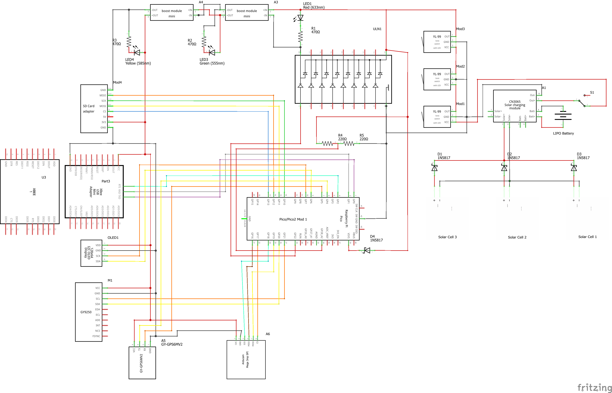
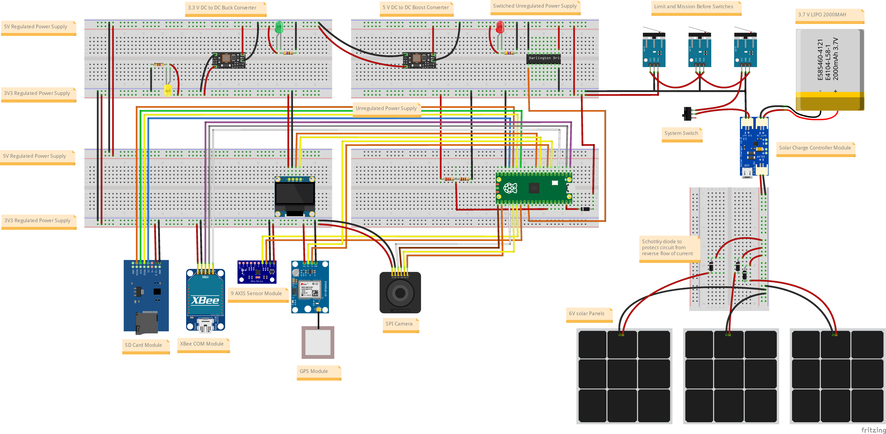

# VyomSat Step 5: Photo Capture with Automatic SD Card Storage

**VyomSat - Essence of Space. Built by You.**

This step builds upon Step 4 (EPS + COM + 9-Axis IMU + GPS + Camera + SD Card) by adding **automatic image transfer to SD card**. When a photo is captured, the system now automatically moves it from the Pico's internal flash memory to the SD card, preserving precious onboard storage space for mission-critical operations.

## Overview

Step 5 enhances the camera imaging system with intelligent file management. The system continuously measures battery voltage, communicates via UART, provides comprehensive attitude data through the MPU9250 IMU, tracks precise geographic location using GPS satellites, captures high-quality images on command, logs sensor data to SD card, and **now automatically transfers captured images to SD card storage**.

**New in Step 5:**
- 📸 **Automatic Photo-to-SD Transfer** - Images automatically moved to SD card after capture
- 🗑️ **Flash Memory Management** - Original files deleted after successful SD transfer
- 🔄 **Seamless Integration** - Single command 'c' handles capture AND storage
- 💾 **Preserved Filenames** - Original auto-incremented names maintained on SD card
- 📺 **Enhanced Feedback** - OLED shows both capture and transfer status
- ⚡ **Optimized Storage** - Pico flash freed immediately after each photo

**Retained from Step 4:**
- 💾 Micro SD Card Module with multi-sensor data logging
- 📝 Multi-cycle sensor data capture (housekeeping, 9-axis IMU, GPS)
- 🎯 Command 's' for comprehensive sensor data logging
- 📊 Timestamped log files

**Retained from Step 3:**
- 📷 ArduCam Mega 3MP Camera with JPEG capture
- 🖼️ Auto-incremented image filenames
- 🎯 Command 'c' for camera capture (now with SD storage)

**Retained from Step 2:**
- 🛰️ NEO-6M GPS Module with position tracking
- 📍 Location Data (latitude, longitude, altitude)
- 🕐 GPS Time & Date with timezone conversion
- 🎯 Command 'g' for GPS data capture

**Retained from Step 1:**
- 🧭 MPU9250 9-Axis IMU (accelerometer, gyroscope, magnetometer)
- 📊 Attitude Data (pitch, roll, heading)
- 🎯 Command 'a' for 9-axis data capture

**Retained from Step 0:**
- 📊 Battery Voltage Monitoring
- 📺 OLED Display (128x64 SSD1306)
- 📡 UART Communication (XBee)
- 🎛️ Command Interface
- ⚡ Hardware Reset Management

## Features

### Photo-to-SD Automatic Transfer (NEW)

The enhanced camera capture system now includes intelligent file management:

- **Automatic Transfer**: Images automatically moved to SD card after capture
- **Original Filename Preserved**: Auto-incremented names maintained (e.g., `vyomsat_image_003.jpg`)
- **Flash Memory Freed**: Original file deleted from Pico after successful transfer
- **Error Handling**: Graceful degradation if SD card unavailable
- **User Feedback**: OLED displays both capture and transfer status
- **UART Responses**: ACK/NAK for both operations

**Photo Capture & Transfer Process:**
1. Command 'c' received via UART
2. OLED shows "Camera" / "Capturing..."
3. Camera captures JPEG image to Pico flash
4. Image saved with auto-incremented filename
5. OLED shows success with filename (3 seconds)
6. OLED shows "Moving to" / "SD card..."
7. File copied to SD card at `/sd/[filename]`
8. Original file deleted from Pico flash
9. OLED shows "Moved to SD!" with filename (2 seconds)
10. UART sends final ACK: "Image saved to SD card"
11. System returns to normal telemetry display

**Benefits:**
- **Storage Efficiency**: Pico flash memory freed immediately
- **Centralized Storage**: All mission data (images + logs) on SD card
- **Mission Longevity**: More photos possible without flash exhaustion
- **Easy Retrieval**: Single SD card contains all mission data
- **Automated Workflow**: No manual file management required

### SD Card Data Logging Capabilities (from Step 4)

The Micro SD Card module provides comprehensive data storage:

- **Multi-Sensor Data Logging**: Comprehensive telemetry capture
  - Housekeeping Data: Battery voltage, timestamps, system uptime
  - 9-Axis IMU Data: Accelerometer, gyroscope, magnetometer, attitude, heading
  - GPS Data: Position, altitude, time, satellites, motion, fix quality
  - Multi-cycle collection: 5 cycles by default (configurable)
  - Cycle timing: 500ms delay between cycles (configurable)

- **Image Storage**: High-resolution JPEG images
  - Auto-incremented filenames: vyomsat_image_XXX.jpg
  - Preserved from original capture
  - Stored at SD card root: /sd/
  - 3MP resolution (2048x1536 pixels)

- **File Management**: Automatic operations
  - Sensor logs: sensor_log_[timestamp].txt
  - Camera images: vyomsat_image_XXX.jpg
  - Unix timestamp for logs
  - Auto-increment counter for images
  - No file overwrites

- **SPI Communication**: High-speed SD card access
  - SPI Bus 1: 1 MHz communication speed (safe initialization)
  - 4-wire interface: SCK, MISO, MOSI, CS
  - Dedicated chip select for SD card control
  - FAT filesystem mounting

- **Card Compatibility**: Wide range of SD cards
  - SDSC (Standard Capacity): Up to 2GB, FAT16
  - SDHC (High Capacity): 2GB to 32GB, FAT32
  - Recommended: FAT32 formatted cards

## Hardware Requirements

### Components

- Raspberry Pi Pico 2 or Pico W
- SSD1306 OLED Display (128x64 pixels, I2C)
- MPU9250 9-Axis IMU Sensor Module (I2C)
- NEO-6M GPS Module (UART)
- ArduCam Mega 3MP SPI Camera Module (OV5642)
- Micro SD Card Module (SPI)
- **Micro SD Card (FAT32, up to 32GB, sufficient space for images)** ← **IMPORTANT**
- XBee module (or compatible UART device)
- Battery voltage divider circuit
- 4.7kΩ pull-up resistors for I2C lines (2x for IMU)

### Wiring Connections

| Component | Pico Pin | Description |
|-----------|----------|-------------|
| **OLED Display** | | |
| SCL | GP7 | I2C Serial Clock |
| SDA | GP6 | I2C Serial Data |
| VCC | 3.3V | Power |
| GND | GND | Ground |
| **MPU9250 9-Axis IMU** | | |
| SCL | GP21 | I2C Serial Clock |
| SDA | GP20 | I2C Serial Data |
| VCC | 3.3V | Power |
| GND | GND | Ground |
| **NEO-6M GPS Module** | | |
| TX (GPS → Pico) | GP5 | UART1 Receive |
| RX (Pico → GPS) | GP4 | UART1 Transmit |
| VCC | 3.3V | Power |
| GND | GND | Ground |
| **ArduCam Mega 3MP** | | |
| SCK | GP18 | SPI0 Serial Clock |
| MISO | GP16 | SPI0 Master In Slave Out |
| MOSI | GP19 | SPI0 Master Out Slave In |
| CS | GP17 | SPI0 Chip Select |
| VCC | 3.3V or 5V | Power (check module specs) |
| GND | GND | Ground |
| **Micro SD Card Module** | | |
| SCK | GP10 | SPI1 Serial Clock |
| MISO | GP12 | SPI1 Master In Slave Out |
| MOSI | GP11 | SPI1 Master Out Slave In |
| CS | GP13 | SPI1 Chip Select |
| VCC | 3.3V or 5V | Power (module has regulator) |
| GND | GND | Ground |
| **XBee Module** | | |
| TX (Pico → XBee) | GP0 | UART0 Transmit |
| RX (XBee → Pico) | GP1 | UART0 Receive |
| RST | GP2 | Hardware Reset (optional) |
| GND | GND | Common Ground |
| **Battery Sensing** | | |
| ADC Input | GP28 | Battery voltage via divider |

> **Important Notes**: 
> - The SD Card Module uses SPI1 communication at 1 MHz (safe initialization speed)
> - **SD card should be formatted as FAT32 with sufficient free space for images**
> - Each 3MP JPEG image is typically 200KB-800KB depending on scene complexity
> - SPI Bus 0 (GP16/GP17/GP18/GP19) is dedicated to camera
> - SPI Bus 1 (GP10/GP11/GP12/GP13) is dedicated to SD card
> - UART1 (GP4/GP5) remains for GPS communication
> - UART0 (GP0/GP1) remains for XBee communication
> - The MPU9250 requires 4.7kΩ pull-up resistors on both SCL and SDA lines
> - Battery voltage must be reduced to 0-3.3V range using a voltage divider circuit
> - SD card module typically includes level shifters for 5V compatibility

### Circuit Diagrams

Visual references for hardware setup are provided using Fritzing diagrams:

#### Schematic Diagram


The schematic shows the complete electrical connections including:
- Solar panel array with charge controller (CN3065)
- Multiple power rails (3.3V, 5V) with boost/buck converters
- Raspberry Pi Pico/Pico2 connections
- OLED display I2C interface (GP6/GP7)
- MPU9250 9-axis IMU I2C interface (GP20/GP21)
- NEO-6M GPS module UART1 interface (GP4/GP5)
- ArduCam Mega 3MP SPI0 interface (GP16/GP17/GP18/GP19)
- Micro SD Card Module SPI1 interface (GP10/GP11/GP12/GP13)
- XBee communication module on UART0 (GP0/GP1)
- Battery voltage sensing circuit
- LED status indicators
- Limit switches for mission control
- Power management components

#### Breadboard Layout


The breadboard layout provides a practical wiring guide showing:
- Physical component placement
- Wire routing and connections
- Power distribution
- Module interconnections
- Camera module positioning and SPI0 connections
- SD card module positioning and SPI1 connections
- GPS module with antenna

#### Bill of Materials (BOM)
A complete parts list with quantities and specifications is available: **[photo-move_bom.html](photo-move_bom.html)**

The BOM includes all components from Steps 0, 1, 2, 3, and 4:
- Micro SD Card Module with SPI interface
- ArduCam Mega 3MP Camera Module
- Level conversion support (5V or 3.3V)
- 42mm × 24mm × 12mm form factor
- Supports Micro SD (≤2GB) and Micro SDHC (≤32GB) cards
- All resistors, capacitors, ICs, and modules required

> **Fritzing Software**: These diagrams were created using [Fritzing](https://fritzing.org/), an open-source electronics design tool. Download from [fritzing.org/download](https://fritzing.org/download/) to view or modify the designs.

## Architecture

The system builds on Step 4's modular architecture with enhanced camera-to-SD integration:

### Updated Module: `vyomsat.py`
Main integration module with enhanced command 'c' handler.

**Changes from Step 4:**
- Updated command 'c' handler to automatically move images to SD card
- Added call to `move_file_to_sd()` after successful image capture
- Enhanced error handling for photo-to-SD transfer
- Improved UART response messages for complete workflow
- Documentation updated for automatic photo transfer

**Command 'c' Handler Flow:**
```
Command 'c' received
    ↓
Display "Capturing..." on OLED
    ↓
Call capture_and_display_image()
    - Captures photo to Pico flash
    - Returns filename if successful
    ↓
If capture successful:
    Display success on OLED (3 seconds)
    ↓
    Display "Moving to SD..." on OLED
    ↓
    Call move_file_to_sd()
        - Copy file to SD card
        - Delete original from flash
        - Display success on OLED
        - Send UART ACK
    ↓
Resume normal telemetry
```

### Enhanced Module: `vyomsat_sd_manager.py`
SD card manager with new file transfer functionality.

**New Function:**
- `move_file_to_sd()`: Moves captured images from Pico flash to SD card

**Key Features:**
- Copies file content from source to SD card destination
- Preserves original filename (auto-incremented camera names)
- Deletes original file after successful copy
- Provides OLED feedback during transfer
- Sends ACK/NAK responses via UART
- Error handling for SD card unavailability
- Warning if file deletion fails (still counts as success since copy worked)

**File Transfer Process:**
1. Check if SD card is initialized
2. Extract filename from source path
3. Build destination path: `/sd/[filename]`
4. Display "Moving to SD..." on OLED
5. Open source file in binary read mode
6. Read entire file content into memory
7. Open destination file in binary write mode
8. Write content to SD card
9. Delete original file from Pico flash
10. Display "Moved to SD!" on OLED (2 seconds)
11. Send UART ACK: "Image saved to SD card"

**OLED Display Feedback:**
During photo-to-SD transfer:
1. **Transfer Screen**: "Moving to" / "SD card..." (during copy)
2. **Success Screen**: "Moved to SD!" / filename (2 seconds)
3. **Error Screen**: "SD Move Error!" / "Failed" (2 seconds)

### Retained Modules from Previous Steps

**`vyomsat_camera_manager.py`**: ArduCam Mega camera management (Step 3)  
**`vyomsat_gps_manager.py`**: NEO-6M GPS sensor management (Step 2)  
**`vyomsat_9axis_manager.py`**: MPU9250 9-axis IMU sensor management (Step 1)  
**`vyomsat_battery_manager.py`**: Battery voltage sensing via ADC (Step 0)  
**`vyomsat_oled_manager.py`**: SSD1306 OLED display management (Step 0)  
**`vyomsat_xbee_manager.py`**: XBee hardware reset handling (Step 0)

## Telemetry Output

### USB Serial Console - Normal Operation
```
[12345ms] Telemetry Sent | V: 6.90V | GPS: 25.2521, 55.3095 | Alt: 15.2m | Sats: 8 | Counter: 42
```

### USB Serial Console - Photo Capture with SD Transfer (Command 'c')
```
UART Command Received: 'c' (ASCII: 99)
Processing camera image capture...
USB Response: Command 'c' received: Camera capture initiated
[INFO] Starting camera capture...
[INFO] Image captured, processing...
[INFO] Saving image as 'vyomsat_image_003.jpg'...
[OK] Image saved as vyomsat_image_003.jpg
[OK] Camera capture SUCCESS: Image saved as vyomsat_image_003.jpg
SD Manager: Moving file to SD card...
  Source: vyomsat_image_003.jpg
  Destination: /sd/vyomsat_image_003.jpg
[OK] SD Manager: File copied to SD card
[OK] SD Manager: Original file deleted
[OK] SD Manager: File moved to SD card: vyomsat_image_003.jpg
UART Response sent: 'ACK: Image saved to SD card' (30 bytes)
```

### USB Serial Console - Photo Capture with SD Error
```
UART Command Received: 'c' (ASCII: 99)
Processing camera image capture...
[OK] Camera capture SUCCESS: Image saved as vyomsat_image_004.jpg
[ERROR] SD Manager: File move failed: SD card not initialized
UART Response sent: 'NAK: SD card not available' (28 bytes)
```

### UART (XBee) - Photo Capture Success
```
ACK: Camera capture initiated
ACK: Image saved as vyomsat_image_003.jpg
ACK: Image saved to SD card
```

### UART (XBee) - SD Transfer Failure
```
ACK: Camera capture initiated
ACK: Image saved as vyomsat_image_004.jpg
NAK: SD card not available
```

### OLED Display - Photo Capture with SD Transfer (Success)
```
[Screen 1 - 0s]
Camera
Capturing...

[Screen 2 - 2s]
Camera OK!
Image saved:
vyomsat_image_00
3.jpg

[Screen 3 - 5s]
Moving to
SD card...

[Screen 4 - 7s]
Moved to SD!
vyomsat_image_00
3.jpg

[Screen 5 - 9s]
VyomSat EPS+GPS
00:05:42
V: 6.90V
Lat:25.2521° N
```

### OLED Display - Normal Operation
```
VyomSat EPS+GPS
00:05:42
V: 6.90V
Lat:25.2521° N
Lon:55.3095° E
```

## Supported UART Commands

Send single character commands to control the system:

| Command | Function | Response | Status |
|---------|----------|----------|--------|
| `c` | **Camera capture + SD transfer** | Image saved to SD card | **ENHANCED** ✨ |
| `s` | SD card data logging | Comprehensive sensor log saved | Active |
| `g` | GPS position data | Comprehensive GPS diagnostics | Active |
| `a` | 9-axis IMU attitude data | Comprehensive sensor data | Active |
| `v` | Request voltage reading | Detailed voltage data | Active |
| `b` | System reset | ACK (placeholder) | Reserved |

### Command 'c' - Camera Capture with SD Transfer (ENHANCED)

**Behavior:**
1. Checks if camera is initialized and available
2. Displays "Capturing..." on OLED
3. Captures JPEG image from camera (3MP resolution)
4. Saves to Pico flash with auto-incremented filename
5. Displays success on OLED with filename (3 seconds)
6. **NEW: Checks if SD card is available**
7. **NEW: Displays "Moving to SD card..." on OLED**
8. **NEW: Copies image file to SD card**
9. **NEW: Deletes original file from Pico flash**
10. **NEW: Displays "Moved to SD!" on OLED (2 seconds)**
11. Sends final ACK/NAK via UART
12. Returns to normal telemetry display

**Example:**
```
Send: c

Receive (UART): ACK: Camera capture initiated
                ACK: Image saved as vyomsat_image_003.jpg
                ACK: Image saved to SD card

Display (OLED): [Capture sequence] → [Transfer sequence] → [Normal telemetry]

Storage: vyomsat_image_003.jpg saved to SD card (/sd/)
         Original file deleted from Pico flash
```

**Photo Capture & Transfer Process:**
1. Command 'c' received via UART
2. Camera availability checked
3. OLED shows "Capturing..."
4. Camera captures 3MP JPEG image
5. Image saved to flash: vyomsat_image_XXX.jpg
6. OLED shows "Camera OK!" + filename (3 seconds)
7. **SD card availability checked**
8. **OLED shows "Moving to SD card..."**
9. **File copied to /sd/vyomsat_image_XXX.jpg**
10. **Original file deleted from flash**
11. **OLED shows "Moved to SD!" + filename (2 seconds)**
12. UART sends final ACK
13. 1-second pause before returning to telemetry

**Benefits of Automatic Transfer:**
- **Flash Memory Preserved**: Pico flash freed after each photo
- **Mission Longevity**: More photos possible without flash exhaustion
- **Centralized Storage**: All data on single SD card
- **No Manual Intervention**: Fully automated workflow
- **Error Recovery**: Graceful degradation if SD unavailable

### Command 's' - SD Card Data Logging

**Example:**
```
Send: s

Receive (UART): ACK: SD card logging initiated
                ACK: Data logged: 5 cycles saved to sensor_log_1729857309.txt

Storage: sensor_log_1729857309.txt saved to SD card
```

### Command 'g' - GPS Position Data

**Example:**
```
Send: g

Receive: ACK: GPS capture initiated
         [comprehensive GPS data follows]
```

### Command 'a' - 9-Axis Attitude Data

**Example:**
```
Send: a

Receive: ACK: MPU9250 capture initiated
         [comprehensive 9-axis IMU data follows]
```

### Command 'v' - Voltage Reading

**Example:**
```
Send: v

Receive: ACK: Battery voltage reading initiated
         [timestamp] BATTERY VOLTAGE | Batt: 6.900V | ADC: 3.450V | Raw: 32768
```

## Usage

### 1. Setup Hardware
Connect all components according to the wiring table above. Pay special attention to:
- Micro SD Card Module on SPI Bus 1 (GP10/11/12/13)
- **SD card formatted as FAT32 with sufficient free space for images**
- ArduCam Mega 3MP on SPI Bus 0 (GP16/17/18/19)
- NEO-6M GPS module on UART1 (GP4 TX, GP5 RX)
- 4.7kΩ pull-up resistors on MPU9250 I2C lines (SCL and SDA)
- Separate I2C buses for OLED (GP6/7) and IMU (GP20/21)
- Common ground connections for all modules

### 2. Prepare SD Card
- Format SD card as FAT32 (recommended for cards >2GB)
- FAT16 works for cards ≤2GB
- **Ensure sufficient free space for images** (each 3MP JPEG: 200KB-800KB)
- Estimate storage: 32GB card can hold thousands of images
- Ensure card is properly inserted in module before powering on

### 3. Get Required Libraries

The manager modules depend on sensor and breakout board libraries from the [OjasJha/micropython-lib](https://github.com/OjasJha/micropython-lib.git) repository.

Clone or download the repository:
```bash
git clone https://github.com/OjasJha/micropython-lib.git
```

**Required libraries for Step 5:**

*From Step 0:*
- `com/uart/uart_handler.py` - UART communication handler

*From Step 1:*
- `io/oled-ssd1306/ssd1306_handler.py` - SSD1306 OLED display driver
- `sensors/mpu9250/mpu9250_handler.py` - MPU9250 9-axis IMU handler
- `sensors/mpu9250/mpu6500_handler.py` - MPU6500 6-axis IMU handler
- `sensors/mpu9250/ak8963_handler.py` - AK8963 3-axis magnetometer handler
- `sensors/mpu9250/mpu9250.py` - Low-level MPU9250 driver
- `sensors/mpu9250/mpu6500.py` - Low-level MPU6500 driver
- `sensors/mpu9250/ak8963.py` - Low-level AK8963 driver

*From Step 2:*
- `sensors/gps/neo6mv2_handler.py` - NEO-6M GPS handler with NMEA parsing

*From Step 3:*
- `io/camera/camera_handler.py` - ArduCam Mega camera handler with JPEG capture

*From Step 4:*
- `io/sd-card/sdcard_handler.py` - SD card driver for SPI-based SD/SDHC cards

> **Important**: Copy these library files directly to the same folder as the VyomSat modules (flat structure). Do NOT maintain the directory structure from the repository.

### 4. Upload Code

Copy all Python files to your Raspberry Pi Pico in the **same folder**:

**VyomSat Step 5 Modules:**
- `vyomsat.py` (updated with auto photo-to-SD)
- `vyomsat_battery_manager.py`
- `vyomsat_oled_manager.py`
- `vyomsat_xbee_manager.py`
- `vyomsat_9axis_manager.py`
- `vyomsat_gps_manager.py`
- `vyomsat_camera_manager.py`
- `vyomsat_sd_manager.py` (updated with move_file_to_sd)

**Libraries from micropython-lib repository:**
- `uart_handler.py` (from `com/uart/`)
- `ssd1306_handler.py` (from `io/oled-ssd1306/`)
- `mpu9250_handler.py` (from `sensors/mpu9250/`)
- `mpu6500_handler.py` (from `sensors/mpu9250/`)
- `ak8963_handler.py` (from `sensors/mpu9250/`)
- `mpu9250.py` (from `sensors/mpu9250/`)
- `mpu6500.py` (from `sensors/mpu9250/`)
- `ak8963.py` (from `sensors/mpu9250/`)
- `neo6mv2_handler.py` (from `sensors/gps/`)
- `camera_handler.py` (from `io/camera/`)
- `sdcard_handler.py` (from `io/sd-card/`)

All files should be in the root directory of your Pico, or in the same folder.

### 5. Run
```python
# On Pico - execute main script
python vyomsat.py
```

Or set it as `main.py` to run automatically on boot.

### 6. Monitor & Test

**Startup:**
1. Watch USB console for initialization messages
2. Verify SD card initialization: `[OK] SD card initialized successfully!`
3. Verify camera initialization: `[OK] Camera initialized successfully!`
4. Verify GPS initialization: `[OK] GPS sensor initialized on UART1`
5. Verify 9-axis IMU initialization: `[OK] 9-axis IMU sensor initialized successfully!`
6. Check OLED display shows normal telemetry

**Photo-to-SD Testing:**
1. Wait for system to fully initialize
2. Send 'c' via UART (XBee)
3. Observe USB console for capture process
4. Watch OLED display for capture feedback (3 seconds)
5. Observe USB console for SD transfer process
6. Watch OLED display for transfer feedback (2 seconds)
7. Receive final ACK via UART
8. **Remove SD card and verify image on computer**
9. **Verify original file deleted from Pico flash**
10. Capture multiple photos to test auto-increment

**Test Command 'c':**
1. Send 'c' via UART
2. Watch OLED show "Capturing..."
3. Observe USB console showing image capture
4. OLED displays success with filename (3 seconds)
5. Watch OLED show "Moving to SD card..."
6. Observe USB console showing file transfer
7. OLED displays "Moved to SD!" with filename (2 seconds)
8. Receive final ACK via UART: "Image saved to SD card"
9. Remove SD card and verify image file exists
10. Check image opens correctly on computer
11. Verify original file NOT on Pico flash
12. Repeat to test multiple sequential captures

**Normal Operation:**
- **USB Console**: Monitor debug output with telemetry and photo capture status (115200 baud)
- **OLED**: View real-time telemetry (battery, GPS position)
- **XBee**: Receive telemetry stream and send commands
- **SD Card**: Store captured images and sensor data logs
- **Pico Flash**: Freed after each photo transfer

## Configuration

Key constants in `vyomsat.py`:

```python
# OLED Display
OLED_SCL_PIN = 7              # I2C clock pin
OLED_SDA_PIN = 6              # I2C data pin

# Battery Monitoring
BATTERY_ADC_CHANNEL = 2                    # ADC2 (GP28)
BATTERY_VOLTAGE_DIVIDER_FACTOR = 0.5       # 2:1 voltage divider

# UART Communication (XBee)
UART_BAUDRATE = 9600          # Standard XBee baudrate
UART_TX_PIN = 0               # GP0
UART_RX_PIN = 1               # GP1

# XBee Reset
XBEE_RESET_PIN = 2            # GP2
XBEE_INIT_DELAY_SECONDS = 5   # Boot delay

# 9-Axis IMU Sensor
NINE_AXIS_SCL_PIN = 21        # GPIO 21 for I2C Serial Clock
NINE_AXIS_SDA_PIN = 20        # GPIO 20 for I2C Serial Data
NINE_AXIS_I2C_FREQ = 400000   # I2C bus frequency (400kHz)

# GPS Sensor
GPS_UART_ID = 1               # UART1 interface
GPS_TX_PIN = 4                # GPIO 4 for UART1 TX
GPS_RX_PIN = 5                # GPIO 5 for UART1 RX
GPS_BAUDRATE = 9600           # NEO-6M default baudrate
GPS_TIMEZONE_OFFSET = 4       # Dubai/UAE timezone (UTC+4)

# SD Card Module
SD_CS_PIN = 13                # GPIO 13 for Chip Select
SD_SCK_PIN = 10               # GPIO 10 for Serial Clock (SPI1)
SD_MOSI_PIN = 11              # GPIO 11 for Master Out Slave In (SPI1)
SD_MISO_PIN = 12              # GPIO 12 for Master In Slave Out (SPI1)
SD_SPI_ID = 1                 # SPI1 interface
SD_BAUDRATE = 1000000         # 1 MHz SPI baudrate

# Telemetry Rate
MAIN_LOOP_DELAY_SECONDS = 4   # Update interval
```

## Understanding Photo-to-SD Operation

### File Transfer Process

The photo-to-SD transfer happens in several stages:

| Stage | Duration | Action | Purpose |
|-------|----------|--------|---------|
| **Camera Capture** | 3-5 seconds | Capture JPEG to flash | Create image file |
| **Flash Storage** | < 1 second | Save with auto-increment | Temporary storage |
| **SD Check** | < 1 second | Verify SD availability | Ensure destination ready |
| **File Copy** | 1-2 seconds | Copy to SD card | Permanent storage |
| **Flash Cleanup** | < 1 second | Delete original | Free memory |

### Storage Management

**Pico Flash Memory:**
- Temporary storage during capture
- Original files deleted after SD transfer
- Freed for next photo or system operations
- No long-term storage burden

**SD Card Storage:**
- Permanent storage for all images
- Organized at root level: /sd/vyomsat_image_XXX.jpg
- Auto-incremented filenames preserved
- Centralized with sensor data logs

### File Naming Convention

Images maintain their auto-incremented names:
- Format: `vyomsat_image_XXX.jpg`
- Counter starts at 000
- Increments with each capture
- Example sequence: vyomsat_image_000.jpg, vyomsat_image_001.jpg, vyomsat_image_002.jpg
- Names preserved when moved to SD card

### Storage Capacity Planning

| SD Card Size | Estimated Images* | Sensor Logs** | Total Capacity |
|--------------|-------------------|---------------|----------------|
| **2GB** | ~2,500 - 10,000 | ~400,000 | Mixed storage |
| **8GB** | ~10,000 - 40,000 | ~1,600,000 | Mixed storage |
| **16GB** | ~20,000 - 80,000 | ~3,200,000 | Mixed storage |
| **32GB** | ~40,000 - 160,000 | ~6,400,000 | Mixed storage |

*Image size varies: 200KB-800KB depending on scene complexity  
**Sensor log size: ~2-5KB per log

## Troubleshooting

| Issue | Solution |
|-------|----------|
| **Photo captured but not on SD** | Check SD card initialization status |
| | Verify USB console shows "File copied to SD card" |
| | Ensure SD card not full |
| | Check SD card not write-protected |
| **Original file not deleted** | Normal if deletion warning shown |
| | Photo still successfully on SD card |
| | Manually delete from Pico if needed |
| **SD transfer fails** | Photo remains on Pico flash |
| | Check SD card availability |
| | Verify SD card has free space |
| | Try removing and reinserting SD card |
| **OLED stuck on "Moving to SD..."** | Wait for timeout or restart system |
| | Check USB console for error details |
| | Verify SD card properly inserted |
| **Multiple photos exhausting Pico flash** | SD card not transferring properly |
| | Manually delete old photos from flash |
| | Check SD card initialization |
| **SD card full** | Transfer card contents to computer |
| | Delete old photos/logs from SD card |
| | Use larger capacity SD card |
| **Image corrupted on SD** | Check power supply stability |
| | Verify SD card is not faulty |
| | Try different SD card |
| | Ensure transfer completes before removal |
| **Auto-increment counter resets** | Normal after flash memory cleared |
| | File manager tracks highest number |
| | Existing files on SD not overwritten |
| **Camera still working?** | Yes - camera independent of SD |
| | Photos saved to flash if SD unavailable |
| | Manual transfer required if SD fails |
| **Sensor logging still working?** | Yes - all subsystems remain operational |
| | Command 's' still logs sensor data |
| | Images and logs share SD card peacefully |

## Technical Details

### Communication Interfaces Summary

| Interface | Pins | Speed | Address/Config | Purpose |
|-----------|------|-------|----------------|---------|
| SPI0 | GP16/17/18/19 | 8 MHz | Bus ID 0 | ArduCam Mega camera |
| SPI1 | GP10/11/12/13 | 1 MHz | Bus ID 1 | Micro SD Card module |
| UART0 | GP0/GP1 | 9600 bps | N81 | XBee communication |
| UART1 | GP4/GP5 | 9600 bps | N81 | GPS module |
| I2C0 | GP6/GP7 | 400 kHz | 0x3C | OLED Display |
| I2C1 | GP20/GP21 | 400 kHz | 0x68, 0x0C | MPU9250 IMU |

### Storage Workflow

```
┌─────────────────────────────────────────┐
│ Command 'c' Received                    │
└────────────────┬────────────────────────┘
                 ↓
┌─────────────────────────────────────────┐
│ Camera Capture                          │
│ - Capture 3MP JPEG image                │
│ - Save to Pico flash memory             │
│ - Filename: vyomsat_image_XXX.jpg       │
└────────────────┬────────────────────────┘
                 ↓
┌─────────────────────────────────────────┐
│ Automatic SD Transfer                   │
│ - Check SD card availability            │
│ - Copy file to /sd/                     │
│ - Preserve filename                     │
│ - Delete original from flash            │
└────────────────┬────────────────────────┘
                 ↓
┌─────────────────────────────────────────┐
│ Result                                  │
│ - Image stored on SD card               │
│ - Pico flash memory freed               │
│ - ACK sent via UART                     │
│ - System ready for next capture         │
└─────────────────────────────────────────┘
```

### Image Specifications

- **Format**: JPEG compressed
- **Resolution**: 3MP (2048x1536 pixels)
- **Sensor**: OV5642 CMOS
- **File Size**: 200KB-800KB (varies by scene)
- **Storage**: SD card (/sd/ directory)
- **Naming**: Auto-incremented (vyomsat_image_XXX.jpg)

### Timing in Main Loop

The main loop includes strategic timing to prevent bus contention:
- **100ms delay**: Prevents GPS UART from interfering with I2C
- **1-second pause**: After operations before resuming telemetry
- **Photo capture**: Temporarily pauses main loop (3-5 seconds)
- **Photo transfer**: Additional 1-2 seconds for SD copy
- **Total command 'c' time**: ~7-10 seconds including OLED displays

## Changes from Step 4

### Software Enhancements
- ✅ Enhanced `vyomsat.py` - Automatic photo-to-SD transfer in command 'c'
- ✅ Enhanced `vyomsat_sd_manager.py` - New `move_file_to_sd()` function
- ✅ File management - Automatic cleanup of Pico flash after transfer
- ✅ OLED feedback - Transfer status displays
- ✅ UART responses - Complete workflow acknowledgments

### Functional Improvements
- ✅ Automatic image transfer to SD card after capture
- ✅ Flash memory freed immediately after each photo
- ✅ Original filenames preserved on SD card
- ✅ Enhanced OLED feedback for complete capture-transfer workflow
- ✅ Improved UART messaging for photo-to-SD operation
- ✅ Graceful degradation when SD card unavailable
- ✅ Error handling for transfer failures
- ✅ Centralized storage management (images + logs on SD)

### Mission Benefits
- ✅ **Extended Mission Duration**: More photos possible without flash exhaustion
- ✅ **Simplified Data Retrieval**: Single SD card contains all mission data
- ✅ **Automated Workflow**: No manual file management required
- ✅ **Storage Efficiency**: Pico flash preserved for critical operations
- ✅ **Operational Reliability**: Graceful handling of SD card issues

## Testing Procedure

### 1. Hardware Verification
- [ ] All connections secure and correct
- [ ] SD card module positioned properly
- [ ] SD card inserted in module
- [ ] **SD card formatted as FAT32 with free space**
- [ ] SPI1 wiring verified (SCK, MISO, MOSI, CS)
- [ ] Camera module wired correctly to SPI0
- [ ] Common ground connected to all modules

### 2. Software Verification
- [ ] All required libraries uploaded to Pico
- [ ] sdcard_handler.py present on Pico
- [ ] camera_handler.py present on Pico
- [ ] Main script runs without errors
- [ ] USB console shows successful initialization

### 3. Camera Initialization Testing
- [ ] Camera initialization message: `[OK] Camera initialized successfully!`
- [ ] SD card initialization message: `[OK] SD card initialized successfully!`
- [ ] No SPI errors during startup
- [ ] Both SPI buses operational

### 4. Command 'c' Testing (Photo Capture)
- [ ] Send 'c' via UART
- [ ] USB console shows capture process
- [ ] OLED displays "Capturing..."
- [ ] OLED shows success with filename (3 seconds)
- [ ] Image filename displayed correctly

### 5. Photo-to-SD Transfer Testing
- [ ] After capture, OLED shows "Moving to SD..."
- [ ] USB console shows file transfer process
- [ ] File copy to SD card succeeds
- [ ] Original file deleted from Pico flash
- [ ] OLED shows "Moved to SD!" with filename (2 seconds)
- [ ] UART receives final ACK: "Image saved to SD card"

### 6. Image Verification
- [ ] Remove SD card safely
- [ ] Insert SD card in computer
- [ ] Image file exists at root: vyomsat_image_XXX.jpg
- [ ] Filename matches auto-increment counter
- [ ] Image file opens successfully
- [ ] Image quality acceptable
- [ ] File size reasonable (200KB-800KB)

### 7. Multi-Photo Testing
- [ ] Capture multiple photos sequentially
- [ ] Each photo auto-increments correctly
- [ ] All photos appear on SD card
- [ ] No photos remain on Pico flash
- [ ] System stable across multiple captures
- [ ] SD card storage not exhausted

### 8. Error Handling Testing
- [ ] Remove SD card and capture photo
- [ ] System handles SD unavailability gracefully
- [ ] Photo remains on Pico flash
- [ ] NAK sent when SD transfer fails
- [ ] Error messages displayed on OLED
- [ ] System continues operating normally
- [ ] Next capture works after SD card reinserted

### 9. Integration Testing
- [ ] Battery voltage displays correctly
- [ ] GPS continues working during photo capture
- [ ] Command 's' (sensor logging) still functional
- [ ] Command 'a' (9-axis) still functional
- [ ] Command 'g' (GPS) still functional
- [ ] OLED returns to telemetry after capture
- [ ] UART telemetry resumes normally
- [ ] All subsystems work together without conflicts

### 10. Storage Management Testing
- [ ] Check Pico flash after multiple captures
- [ ] Verify no old photos accumulating
- [ ] Check SD card free space decreasing appropriately
- [ ] Verify filenames don't conflict
- [ ] Test with near-full SD card
- [ ] Verify error handling when SD card full

## License

MIT License - Copyright (c) 2025 Ojas Jha

See individual Python files for full license text.

## Author

**Ojas Jha**  
VyomSat CubeSat Education Kit  
Date: October 25, 2025

## Acknowledgments

- Steps 0-4 (EPS, COM, 9-Axis, GPS, Camera, SD Card) provide the foundation
- Enhanced camera-to-SD integration for mission efficiency
- Automated file management for extended mission duration
- ArduCam Mega 3MP camera with JPEG compression
- Micro SD Card Module with FAT32 filesystem support
- Fritzing diagrams created with Fritzing open-source software

## References

- MicroPython SD Card Driver Documentation
- ArduCam Mega Camera Documentation
- SD Card Association: SD/SDHC Specifications
- FAT Filesystem Documentation
- Raspberry Pi Pico SPI Documentation
- MicroPython File I/O Reference
- Image Storage Best Practices for Embedded Systems

